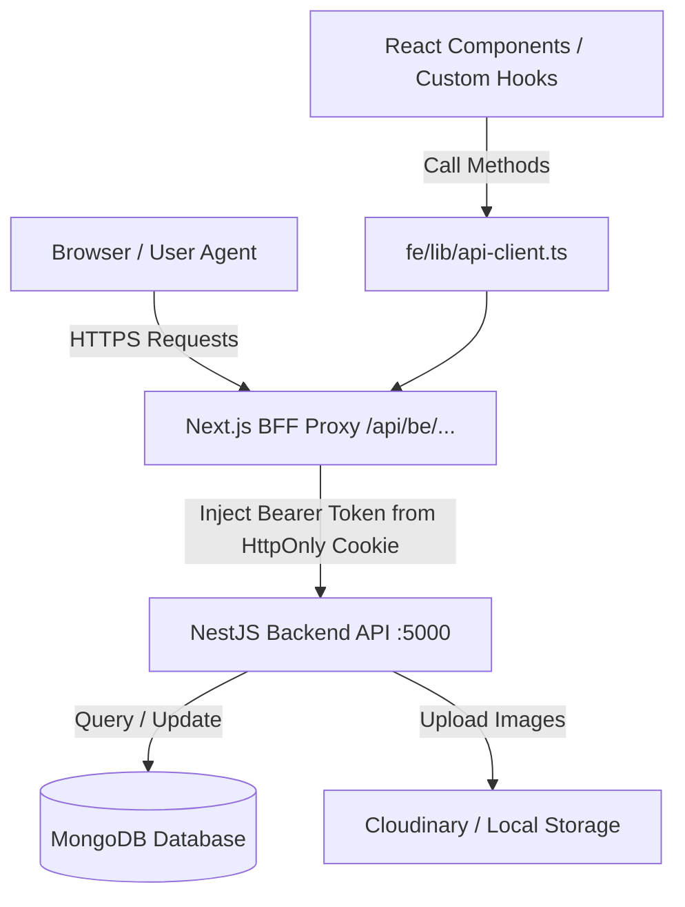

# BẢN ĐỒ KIẾN TRÚC VÀ CHỨC NĂNG HỆ THỐNG HORSETRACK (BE & FE MAP)

> **Dự án:** HorseTrack - Hệ thống Quản lý Giải đua Ngựa & Dự đoán Cược Motorsport  
> **Tài liệu dành cho:** Admin, Tech Lead & Dev Team  
> **Kiến trúc:**  
> - **Backend (BE):** NestJS (TypeScript), MongoDB (Mongoose ODM), JWT HttpOnly Cookie, Throttler Rate Limit, WebSocket/Cron Scheduler.  
> - **Frontend (FE):** Next.js 15 (App Router), React, TypeScript, TailwindCSS, BFF Proxy Pattern (`/api/be/...`), Centralized API Client (`api-client.ts`).

---

## 1. TỔNG QUAN LUỒNG DỮ LIỆU & KIẾN TRÚC INTERACTION

---

## 2. BẢN ĐỒ CHI TIẾT TỪNG CHỨC NĂNG (FEATURE MAP)

### 1. Xác thực & Phân quyền (Authentication & Authorization)
* **Mô tả:** Đăng ký, đăng nhập, cấp refresh/access token qua HttpOnly cookie bảo mật, kiểm tra quyền theo vai trò (ADMIN, HORSE_OWNER, JOCKEY, REFEREE, SPECTATOR, COUNTER_STAFF).
* **Backend (BE):**
  - Controller: [`auth.controller.ts`](file:///d:/SU26/WDP301/HorseTrack/be/src/auth/auth.controller.ts)
  - Service: [`auth.service.ts`](file:///d:/SU26/WDP301/HorseTrack/be/src/auth/auth.service.ts)
  - Strategy & Guard: [`jwt.strategy.ts`](file:///d:/SU26/WDP301/HorseTrack/be/src/auth/strategies/jwt.strategy.ts), [`roles.guard.ts`](file:///d:/SU26/WDP301/HorseTrack/be/src/common/guards/roles.guard.ts)
  - DTOs: [`dto/login.dto.ts`](file:///d:/SU26/WDP301/HorseTrack/be/src/auth/dto/login.dto.ts), [`dto/register.dto.ts`](file:///d:/SU26/WDP301/HorseTrack/be/src/auth/dto/register.dto.ts)
* **Frontend (FE):**
  - Trang Auth: [`fe/app/(auth)/login/page.tsx`](file:///d:/SU26/WDP301/HorseTrack/fe/app/(auth)/login/page.tsx), [`fe/app/(auth)/register/page.tsx`](file:///d:/SU26/WDP301/HorseTrack/fe/app/(auth)/register/page.tsx)
  - BFF Proxy Auth: [`fe/app/api/auth/login/route.ts`](file:///d:/SU26/WDP301/HorseTrack/fe/app/api/auth/login/route.ts), [`fe/app/api/auth/refresh/route.ts`](file:///d:/SU26/WDP301/HorseTrack/fe/app/api/auth/refresh/route.ts)
  - Components: [`fe/features/auth/components/login-form.tsx`](file:///d:/SU26/WDP301/HorseTrack/fe/features/auth/components/login-form.tsx), [`fe/features/auth/components/register-form.tsx`](file:///d:/SU26/WDP301/HorseTrack/fe/features/auth/components/register-form.tsx)

---

### 2. Quản lý Người dùng (User Management)
* **Mô tả:** Admin quản lý danh sách người dùng, đổi role, khóa (Ban) / mở khóa (Unban) tài khoản. Người dùng tự cập nhật profile cá nhân.
* **Backend (BE):**
  - Controller: [`users.controller.ts`](file:///d:/SU26/WDP301/HorseTrack/be/src/users/users.controller.ts)
  - Service: [`users.service.ts`](file:///d:/SU26/WDP301/HorseTrack/be/src/users/users.service.ts)
  - Schema: [`schemas/user.schema.ts`](file:///d:/SU26/WDP301/HorseTrack/be/src/users/schemas/user.schema.ts)
* **Frontend (FE):**
  - Admin Page: [`fe/app/(dashboard)/admin/users/page.tsx`](file:///d:/SU26/WDP301/HorseTrack/fe/app/(dashboard)/admin/users/page.tsx)
  - User Profile Page: [`fe/app/(dashboard)/profile/page.tsx`](file:///d:/SU26/WDP301/HorseTrack/fe/app/(dashboard)/profile/page.tsx)
  - API Integration: `usersApi` trong [`fe/lib/api-client.ts`](file:///d:/SU26/WDP301/HorseTrack/fe/lib/api-client.ts#L113)

---

### 3. Quản lý Ngưa đua (Horse Management)
* **Mô tả:** Chủ ngựa tạo hồ sơ ngựa (chỉ số tốc độ baseSpeed, staminaScore, sức khỏe), Admin xem xét và Duyệt (Approve) hoặc Từ chối (Reject).
* **Backend (BE):**
  - Controller: [`horses.controller.ts`](file:///d:/SU26/WDP301/HorseTrack/be/src/horses/horses.controller.ts)
  - Service: [`horses.service.ts`](file:///d:/SU26/WDP301/HorseTrack/be/src/horses/horses.service.ts)
  - Schema: [`schemas/horse.schema.ts`](file:///d:/SU26/WDP301/HorseTrack/be/src/horses/schemas/horse.schema.ts)
* **Frontend (FE):**
  - Admin Page: [`fe/app/(dashboard)/admin/horses/page.tsx`](file:///d:/SU26/WDP301/HorseTrack/fe/app/(dashboard)/admin/horses/page.tsx)
  - Owner Page: [`fe/app/(dashboard)/owner/horses/page.tsx`](file:///d:/SU26/WDP301/HorseTrack/fe/app/(dashboard)/owner/horses/page.tsx)
  - Feature UI Components: [`fe/features/horses/components/horse-card.tsx`](file:///d:/SU26/WDP301/HorseTrack/fe/features/horses/components/horse-card.tsx), [`fe/features/horses/components/horse-form.tsx`](file:///d:/SU26/WDP301/HorseTrack/fe/features/horses/components/horse-form.tsx)
  - API Integration: `horsesApi` trong [`fe/lib/api-client.ts`](file:///d:/SU26/WDP301/HorseTrack/fe/lib/api-client.ts#L158)

---

### 4. Quản lý Nài ngựa & Hồ sơ (Jockey Management)
* **Mô tả:** Nài ngựa tạo hồ sơ chuyên nghiệp (chiều cao, cân nặng, kinh nghiệm, bằng cấp), Admin duyệt/từ chối hồ sơ nài.
* **Backend (BE):**
  - Controller: [`jockeys.controller.ts`](file:///d:/SU26/WDP301/HorseTrack/be/src/jockeys/jockeys.controller.ts)
  - Service: [`jockeys.service.ts`](file:///d:/SU26/WDP301/HorseTrack/be/src/jockeys/jockeys.service.ts)
  - Schema: [`schemas/jockey.schema.ts`](file:///d:/SU26/WDP301/HorseTrack/be/src/jockeys/schemas/jockey.schema.ts)
* **Frontend (FE):**
  - Admin Page: [`fe/app/(dashboard)/admin/jockeys/page.tsx`](file:///d:/SU26/WDP301/HorseTrack/fe/app/(dashboard)/admin/jockeys/page.tsx)
  - Jockey Profile Page: [`fe/app/(dashboard)/jockey/profile/page.tsx`](file:///d:/SU26/WDP301/HorseTrack/fe/app/(dashboard)/jockey/profile/page.tsx)
  - API Integration: `jockeysApi` trong [`fe/lib/api-client.ts`](file:///d:/SU26/WDP301/HorseTrack/fe/lib/api-client.ts#L195)

---

### 5. Lời mời Nài ngựa (Jockey Invitations)
* **Mô tả:** Chủ ngựa gửi lời mời Nài ngựa điều khiển ngựa trong trận đua; Nài ngựa phản hồi (Đồng ý / Từ chối).
* **Backend (BE):**
  - Controller: [`jockey-invitations.controller.ts`](file:///d:/SU26/WDP301/HorseTrack/be/src/jockey-invitations/jockey-invitations.controller.ts)
  - Service: [`jockey-invitations.service.ts`](file:///d:/SU26/WDP301/HorseTrack/be/src/jockey-invitations/jockey-invitations.service.ts)
  - Schema: [`schemas/jockey-invitation.schema.ts`](file:///d:/SU26/WDP301/HorseTrack/be/src/jockey-invitations/schemas/jockey-invitation.schema.ts)
* **Frontend (FE):**
  - Owner Page: [`fe/app/(dashboard)/owner/invitations/page.tsx`](file:///d:/SU26/WDP301/HorseTrack/fe/app/(dashboard)/owner/invitations/page.tsx)
  - Jockey Page: [`fe/app/(dashboard)/jockey/invitations/page.tsx`](file:///d:/SU26/WDP301/HorseTrack/fe/app/(dashboard)/jockey/invitations/page.tsx)
  - API Integration: `jockeyInvitationsApi` trong [`fe/lib/api-client.ts`](file:///d:/SU26/WDP301/HorseTrack/fe/lib/api-client.ts)

---

### 6. Quản lý Giải đấu (Tournaments Management)
* **Mô tả:** Admin khởi tạo giải đấu, quy định thời gian đăng ký, tổng quỹ thưởng (prizePool), địa điểm và trạng thái giải đấu.
* **Backend (BE):**
  - Controller: [`tournaments.controller.ts`](file:///d:/SU26/WDP301/HorseTrack/be/src/tournaments/tournaments.controller.ts)
  - Service: [`tournaments.service.ts`](file:///d:/SU26/WDP301/HorseTrack/be/src/tournaments/tournaments.service.ts)
  - Schema: [`schemas/tournament.schema.ts`](file:///d:/SU26/WDP301/HorseTrack/be/src/tournaments/schemas/tournament.schema.ts)
* **Frontend (FE):**
  - Public Page: [`fe/app/(public)/tournaments/page.tsx`](file:///d:/SU26/WDP301/HorseTrack/fe/app/(public)/tournaments/page.tsx)
  - Admin Page: [`fe/app/(dashboard)/admin/tournaments/page.tsx`](file:///d:/SU26/WDP301/HorseTrack/fe/app/(dashboard)/admin/tournaments/page.tsx)
  - Feature Components: [`fe/features/tournaments/components/tournament-card.tsx`](file:///d:/SU26/WDP301/HorseTrack/fe/features/tournaments/components/tournament-card.tsx)
  - API Integration: `tournamentsApi` trong [`fe/lib/api-client.ts`](file:///d:/SU26/WDP301/HorseTrack/fe/lib/api-client.ts#L251)

---

### 7. Đăng ký Tham gia Đua (Race Registrations)
* **Mô tả:** Chủ ngựa đăng ký ngựa vào trận đua/giải đấu. Admin duyệt đơn đăng ký để ghi tên ngựa vào danh sách thi đấu chính thức.
* **Backend (BE):**
  - Controller: [`registrations.controller.ts`](file:///d:/SU26/WDP301/HorseTrack/be/src/registrations/registrations.controller.ts)
  - Service: [`registrations.service.ts`](file:///d:/SU26/WDP301/HorseTrack/be/src/registrations/registrations.service.ts)
  - Schema: [`schemas/registration.schema.ts`](file:///d:/SU26/WDP301/HorseTrack/be/src/registrations/schemas/registration.schema.ts)
* **Frontend (FE):**
  - Owner Registration: [`fe/app/(dashboard)/owner/registrations/page.tsx`](file:///d:/SU26/WDP301/HorseTrack/fe/app/(dashboard)/owner/registrations/page.tsx)
  - Admin Review Queue: [`fe/app/(dashboard)/admin/registrations/page.tsx`](file:///d:/SU26/WDP301/HorseTrack/fe/app/(dashboard)/admin/registrations/page.tsx)
  - Feature UI: [`fe/features/registrations/components/registration-table.tsx`](file:///d:/SU26/WDP301/HorseTrack/fe/features/registrations/components/registration-table.tsx)
  - API Integration: `registrationsApi` trong [`fe/lib/api-client.ts`](file:///d:/SU26/WDP301/HorseTrack/fe/lib/api-client.ts)

---

### 8. Quản lý Trận đua (Races Management)
* **Mô tả:** Tạo trận đua thuộc giải đấu, xếp lane thi đấu, điều khiển vòng đời trận đua (`SCHEDULED` -> `READY` -> `IN_PROGRESS` -> `COMPLETED`).
* **Backend (BE):**
  - Controller: [`races.controller.ts`](file:///d:/SU26/WDP301/HorseTrack/be/src/races/races.controller.ts)
  - Service: [`races.service.ts`](file:///d:/SU26/WDP301/HorseTrack/be/src/races/races.service.ts)
  - Schema: [`schemas/race.schema.ts`](file:///d:/SU26/WDP301/HorseTrack/be/src/races/schemas/race.schema.ts)
* **Frontend (FE):**
  - Public Races Page: [`fe/app/(public)/races/page.tsx`](file:///d:/SU26/WDP301/HorseTrack/fe/app/(public)/races/page.tsx)
  - Admin Races Management: [`fe/app/(dashboard)/admin/races/page.tsx`](file:///d:/SU26/WDP301/HorseTrack/fe/app/(dashboard)/admin/races/page.tsx)
  - Feature Components: [`fe/features/races/components/race-card.tsx`](file:///d:/SU26/WDP301/HorseTrack/fe/features/races/components/race-card.tsx), [`fe/features/races/components/race-form.tsx`](file:///d:/SU26/WDP301/HorseTrack/fe/features/races/components/race-form.tsx)
  - API Integration: `racesApi` trong [`fe/lib/api-client.ts`](file:///d:/SU26/WDP301/HorseTrack/fe/lib/api-client.ts#L300)

---

### 9. Kiểm tra Đầu Trận đua (Race Checks)
* **Mô tả:** Trọng tài tiến hành kiểm tra y tế cho ngựa và kiểm tra cân nặng nài ngựa trước giờ cất cánh (Pre-race Check).
* **Backend (BE):**
  - Controller: [`race-checks.controller.ts`](file:///d:/SU26/WDP301/HorseTrack/be/src/race-checks/race-checks.controller.ts)
  - Service: [`race-checks.service.ts`](file:///d:/SU26/WDP301/HorseTrack/be/src/race-checks/race-checks.service.ts)
  - Schema: [`schemas/race-check.schema.ts`](file:///d:/SU26/WDP301/HorseTrack/be/src/race-checks/schemas/race-check.schema.ts)
* **Frontend (FE):**
  - Referee Checklist UI: [`fe/app/(dashboard)/referee/checklist/page.tsx`](file:///d:/SU26/WDP301/HorseTrack/fe/app/(dashboard)/referee/checklist/page.tsx)
  - Feature Component: [`fe/features/referee-reports/components/race-checklist.tsx`](file:///d:/SU26/WDP301/HorseTrack/fe/features/referee-reports/components/race-checklist.tsx)

---

### 10. Ghi nhận Vi phạm Trận đua (Race Violations)
* **Mô tả:** Ghi nhận các lỗi phạm quy của nài ngựa trong trận đua (lấn lane, xuất phát sớm, phạm quy dùng roi...).
* **Backend (BE):**
  - Controller: [`race-violations.controller.ts`](file:///d:/SU26/WDP301/HorseTrack/be/src/race-violations/race-violations.controller.ts)
  - Service: [`race-violations.service.ts`](file:///d:/SU26/WDP301/HorseTrack/be/src/race-violations/race-violations.service.ts)
  - Schema: [`schemas/race-violation.schema.ts`](file:///d:/SU26/WDP301/HorseTrack/be/src/race-violations/schemas/race-violation.schema.ts)
* **Frontend (FE):**
  - Referee Violation Route: [`fe/app/(dashboard)/referee/violations/page.tsx`](file:///d:/SU26/WDP301/HorseTrack/fe/app/(dashboard)/referee/violations/page.tsx)
  - Feature Components: [`fe/features/referee-reports/components/violation-quick-add.tsx`](file:///d:/SU26/WDP301/HorseTrack/fe/features/referee-reports/components/violation-quick-add.tsx)

---

### 11. Nhập & Công bố Kết quả Trận đua (Race Results & Rankings)
* **Mô tả:** Trọng tài nhập thành tích (thời gian về đích, thứ hạng), Admin kiểm tra và bấm Công bố Kết quả (Publish Result), tự động chốt kết quả cược và thưởng.
* **Backend (BE):**
  - Controller: [`race-results.controller.ts`](file:///d:/SU26/WDP301/HorseTrack/be/src/race-results/race-results.controller.ts), [`rankings.controller.ts`](file:///d:/SU26/WDP301/HorseTrack/be/src/rankings/rankings.controller.ts)
  - Service: [`race-results.service.ts`](file:///d:/SU26/WDP301/HorseTrack/be/src/race-results/race-results.service.ts), [`rankings.service.ts`](file:///d:/SU26/WDP301/HorseTrack/be/src/rankings/rankings.service.ts)
  - Schema: [`schemas/race-result.schema.ts`](file:///d:/SU26/WDP301/HorseTrack/be/src/race-results/schemas/race-result.schema.ts)
* **Frontend (FE):**
  - Referee Entry Page: [`fe/app/(dashboard)/referee/results/page.tsx`](file:///d:/SU26/WDP301/HorseTrack/fe/app/(dashboard)/referee/results/page.tsx)
  - Admin Publish Review Page: [`fe/app/(dashboard)/admin/results/page.tsx`](file:///d:/SU26/WDP301/HorseTrack/fe/app/(dashboard)/admin/results/page.tsx)
  - Feature Components: [`fe/features/referee-reports/components/result-entry-form.tsx`](file:///d:/SU26/WDP301/HorseTrack/fe/features/referee-reports/components/result-entry-form.tsx), `PublishResultDialog`

---

### 12. Báo cáo & Phân công Trọng tài (Referee Profiles, Assignments & Reports)
* **Mô tả:** Quản lý danh sách trọng tài, phân công nhiệm vụ trận đua và nộp báo cáo tổng kết sau trận đua gửi cho Admin.
* **Backend (BE):**
  - Controllers: [`referee-profiles.controller.ts`](file:///d:/SU26/WDP301/HorseTrack/be/src/referee-profiles/referee-profiles.controller.ts), [`referee-assignments.controller.ts`](file:///d:/SU26/WDP301/HorseTrack/be/src/referee-assignments/referee-assignments.controller.ts), [`referee-reports.controller.ts`](file:///d:/SU26/WDP301/HorseTrack/be/src/referee-reports/referee-reports.controller.ts)
  - Services: [`referee-reports.service.ts`](file:///d:/SU26/WDP301/HorseTrack/be/src/referee-reports/referee-reports.service.ts), [`referee-assignments.service.ts`](file:///d:/SU26/WDP301/HorseTrack/be/src/referee-assignments/referee-assignments.service.ts)
* **Frontend (FE):**
  - Admin Assignments Page: [`fe/app/(dashboard)/admin/referee-assignments/page.tsx`](file:///d:/SU26/WDP301/HorseTrack/fe/app/(dashboard)/admin/referee-assignments/page.tsx)
  - Referee Reports Page: [`fe/app/(dashboard)/referee/reports/page.tsx`](file:///d:/SU26/WDP301/HorseTrack/fe/app/(dashboard)/referee/reports/page.tsx)

---

### 13. Giải thưởng & Phần thưởng (Prizes & Prize Allocation)
* **Mô tả:** Tính toán phân bổ tiền thưởng theo cơ cấu giải thưởng (1st, 2nd, 3rd place) từ tổng prizePool của giải đua.
* **Backend (BE):**
  - Controller: [`prizes.controller.ts`](file:///d:/SU26/WDP301/HorseTrack/be/src/prizes/prizes.controller.ts)
  - Service: [`prizes.service.ts`](file:///d:/SU26/WDP301/HorseTrack/be/src/prizes/prizes.service.ts)
  - Schema: [`schemas/prize.schema.ts`](file:///d:/SU26/WDP301/HorseTrack/be/src/prizes/schemas/prize.schema.ts)
* **Frontend (FE):**
  - Admin Prizes Management: [`fe/app/(dashboard)/admin/prizes/page.tsx`](file:///d:/SU26/WDP301/HorseTrack/fe/app/(dashboard)/admin/prizes/page.tsx)
  - API Integration: `prizesApi` trong [`fe/lib/api-client.ts`](file:///d:/SU26/WDP301/HorseTrack/fe/lib/api-client.ts)

---

### 14. Dự đoán / Đặt cược & Tỷ lệ Cược (Predictions & Odds)
* **Mô tả:** Khán giả (Spectator) hoặc Nhân viên quầy (Counter Staff) chọn ngựa dự đoán thắng trận, tính toán tỷ lệ cược (Odds) động, và tự động trả thưởng vào ví khi có kết quả.
* **Backend (BE):**
  - Controller: [`predictions.controller.ts`](file:///d:/SU26/WDP301/HorseTrack/be/src/predictions/predictions.controller.ts)
  - Service: [`predictions.service.ts`](file:///d:/SU26/WDP301/HorseTrack/be/src/predictions/predictions.service.ts)
  - Schema: [`schemas/prediction.schema.ts`](file:///d:/SU26/WDP301/HorseTrack/be/src/predictions/schemas/prediction.schema.ts)
* **Frontend (FE):**
  - Spectator Predictions Page: [`fe/app/(dashboard)/spectator/predictions/page.tsx`](file:///d:/SU26/WDP301/HorseTrack/fe/app/(dashboard)/spectator/predictions/page.tsx)
  - Counter Staff Page: [`fe/app/(dashboard)/counter-staff/predictions/page.tsx`](file:///d:/SU26/WDP301/HorseTrack/fe/app/(dashboard)/counter-staff/predictions/page.tsx)
  - Admin Bets Control: [`fe/app/(dashboard)/admin/bets/page.tsx`](file:///d:/SU26/WDP301/HorseTrack/fe/app/(dashboard)/admin/bets/page.tsx)
  - API Integration: `predictionsApi` trong [`fe/lib/api-client.ts`](file:///d:/SU26/WDP301/HorseTrack/fe/lib/api-client.ts#L612)

---

### 15. Quản lý Ví điện tử & Nạp/Rút Tiền (Wallet, Transactions & Cashout)
* **Mô tả:** Quản lý số dư Token/VND của người dùng, giao dịch nạp tiền, tạo yêu cầu rút tiền (Cashout), và Admin duyệt lệnh rút tiền.
* **Backend (BE):**
  - Controller: [`wallet.controller.ts`](file:///d:/SU26/WDP301/HorseTrack/be/src/wallet/wallet.controller.ts)
  - Service: [`wallet.service.ts`](file:///d:/SU26/WDP301/HorseTrack/be/src/wallet/wallet.service.ts)
  - Schema: [`schemas/wallet.schema.ts`](file:///d:/SU26/WDP301/HorseTrack/be/src/wallet/schemas/wallet.schema.ts)
* **Frontend (FE):**
  - Spectator Wallet Page: [`fe/app/(dashboard)/spectator/wallet/page.tsx`](file:///d:/SU26/WDP301/HorseTrack/fe/app/(dashboard)/spectator/wallet/page.tsx)
  - Owner Wallet Page: [`fe/app/(dashboard)/owner/wallet/page.tsx`](file:///d:/SU26/WDP301/HorseTrack/fe/app/(dashboard)/owner/wallet/page.tsx)
  - Admin Wallet & Cashout Review: [`fe/app/(dashboard)/admin/wallet/page.tsx`](file:///d:/SU26/WDP301/HorseTrack/fe/app/(dashboard)/admin/wallet/page.tsx), [`fe/app/(dashboard)/admin/cashouts/page.tsx`](file:///d:/SU26/WDP301/HorseTrack/fe/app/(dashboard)/admin/cashouts/page.tsx)
  - Feature UI: [`fe/features/wallet/components/wallet-card.tsx`](file:///d:/SU26/WDP301/HorseTrack/fe/features/wallet/components/wallet-card.tsx)
  - API Integration: `walletApi` trong [`fe/lib/api-client.ts`](file:///d:/SU26/WDP301/HorseTrack/fe/lib/api-client.ts#L660)

---

### 16. Phân tích AI & Gợi ý (AI Race Analysis)
* **Mô tả:** Phân tích phong độ lịch sử của ngựa và nài ngựa để AI gợi ý xác suất chiến thắng và tỷ lệ cược tham khảo cho Admin.
* **Backend (BE):**
  - Controller: [`ai.controller.ts`](file:///d:/SU26/WDP301/HorseTrack/be/src/ai/ai.controller.ts)
  - Service: [`ai.service.ts`](file:///d:/SU26/WDP301/HorseTrack/be/src/ai/ai.service.ts)
* **Frontend (FE):**
  - Admin AI Dashboard Page: [`fe/app/(dashboard)/admin/ai/page.tsx`](file:///d:/SU26/WDP301/HorseTrack/fe/app/(dashboard)/admin/ai/page.tsx)
  - API Integration: `aiApi` trong [`fe/lib/api-client.ts`](file:///d:/SU26/WDP301/HorseTrack/fe/lib/api-client.ts)

---

### 17. Thông báo Hệ thống (Notifications)
* **Mô tả:** Gửi và hiển thị thông báo thời gian thực/chuông thông báo cho người dùng khi có sự kiện quan trọng (được duyệt ngựa, nhận lời mời nài, thắng cược, kết quả đua).
* **Backend (BE):**
  - Controller: [`notifications.controller.ts`](file:///d:/SU26/WDP301/HorseTrack/be/src/notifications/notifications.controller.ts)
  - Service: [`notifications.service.ts`](file:///d:/SU26/WDP301/HorseTrack/be/src/notifications/notifications.service.ts)
  - Schema: [`schemas/notification.schema.ts`](file:///d:/SU26/WDP301/HorseTrack/be/src/notifications/schemas/notification.schema.ts)
* **Frontend (FE):**
  - Notification Component: [`fe/components/layout/notification-bell.tsx`](file:///d:/SU26/WDP301/HorseTrack/fe/components/layout/notification-bell.tsx)
  - BFF Route: [`fe/app/api/notifications/route.ts`](file:///d:/SU26/WDP301/HorseTrack/fe/app/api/notifications/route.ts)
  - API Integration: `notificationsApi` trong [`fe/lib/api-client.ts`](file:///d:/SU26/WDP301/HorseTrack/fe/lib/api-client.ts)

---

### 18. Dashboard Overview & Thống kê KPI
* **Mô tả:** Màn hình trang chủ Dashboard hiển thị các số liệu thống kê KPI theo từng vai trò người dùng (Admin, Owner, Jockey, Referee, Spectator).
* **Backend (BE):**
  - Controller: [`dashboard.controller.ts`](file:///d:/SU26/WDP301/HorseTrack/be/src/dashboard/dashboard.controller.ts)
  - Service: [`dashboard.service.ts`](file:///d:/SU26/WDP301/HorseTrack/be/src/dashboard/dashboard.service.ts)
* **Frontend (FE):**
  - Admin Overview: [`fe/app/(dashboard)/admin/page.tsx`](file:///d:/SU26/WDP301/HorseTrack/fe/app/(dashboard)/admin/page.tsx)
  - Shared Shell: [`fe/components/layout/role-dashboard-shell.tsx`](file:///d:/SU26/WDP301/HorseTrack/fe/components/layout/role-dashboard-shell.tsx)
  - Feature UI: [`fe/features/dashboard/components/admin-overview.tsx`](file:///d:/SU26/WDP301/HorseTrack/fe/features/dashboard/components/admin-overview.tsx)

---

### 19. Tải tệp & Hình ảnh (Uploads & Cloudinary)
* **Mô tả:** Quản lý tải lên hình ảnh đại diện, hình ảnh ngựa đua, ảnh bằng cấp nài ngựa lưu trữ qua Cloudinary hoặc thư mục uploads.
* **Backend (BE):**
  - Controller: [`uploads.controller.ts`](file:///d:/SU26/WDP301/HorseTrack/be/src/uploads/uploads.controller.ts)
  - Service: [`uploads.service.ts`](file:///d:/SU26/WDP301/HorseTrack/be/src/uploads/uploads.service.ts), [`cloudinary.service.ts`](file:///d:/SU26/WDP301/HorseTrack/be/src/cloudinary/cloudinary.service.ts)
* **Frontend (FE):**
  - BFF Proxy: [`fe/app/api/uploads/route.ts`](file:///d:/SU26/WDP301/HorseTrack/fe/app/api/uploads/route.ts)

---

### 20. Nhật ký Hệ thống (Audit Logs)
* **Mô tả:** Lưu lại lịch sử thao tác của Admin và người dùng đối với các dữ liệu nhạy cảm (duyệt ngựa, duyệt cược, xóa tài khoản, sửa điểm).
* **Backend (BE):**
  - Controller: [`audit-logs.controller.ts`](file:///d:/SU26/WDP301/HorseTrack/be/src/audit-logs/audit-logs.controller.ts)
  - Service: [`audit-logs.service.ts`](file:///d:/SU26/WDP301/HorseTrack/be/src/audit-logs/audit-logs.service.ts)
  - Schema: [`schemas/audit-log.schema.ts`](file:///d:/SU26/WDP301/HorseTrack/be/src/audit-logs/schemas/audit-log.schema.ts)
* **Frontend (FE):**
  - Admin Audit Logs View: Đã tích hợp trong các màn hình quản trị Admin & API Client.

---

## 3. BẢNG TỔNG HỢP ÁNH XẠ FILE NHANH (QUICK REFERENCE MATRIX)

| Tên Mô-đun / Chức năng | Đường dẫn Backend Primary (BE) | Đường dẫn Frontend Primary (FE) | API Client (`api-client.ts`) |
| :--- | :--- | :--- | :--- |
| **Xác thực (Auth)** | [`be/src/auth/auth.controller.ts`](file:///d:/SU26/WDP301/HorseTrack/be/src/auth/auth.controller.ts) | [`fe/app/(auth)/login/page.tsx`](file:///d:/SU26/WDP301/HorseTrack/fe/app/(auth)/login/page.tsx) | `authApi` |
| **Người dùng (Users)** | [`be/src/users/users.controller.ts`](file:///d:/SU26/WDP301/HorseTrack/be/src/users/users.controller.ts) | [`fe/app/(dashboard)/admin/users/page.tsx`](file:///d:/SU26/WDP301/HorseTrack/fe/app/(dashboard)/admin/users/page.tsx) | `usersApi` |
| **Ngựa (Horses)** | [`be/src/horses/horses.controller.ts`](file:///d:/SU26/WDP301/HorseTrack/be/src/horses/horses.controller.ts) | [`fe/app/(dashboard)/admin/horses/page.tsx`](file:///d:/SU26/WDP301/HorseTrack/fe/app/(dashboard)/admin/horses/page.tsx) | `horsesApi` |
| **Nài ngựa (Jockeys)** | [`be/src/jockeys/jockeys.controller.ts`](file:///d:/SU26/WDP301/HorseTrack/be/src/jockeys/jockeys.controller.ts) | [`fe/app/(dashboard)/jockey/profile/page.tsx`](file:///d:/SU26/WDP301/HorseTrack/fe/app/(dashboard)/jockey/profile/page.tsx) | `jockeysApi` |
| **Giải đấu (Tournaments)** | [`be/src/tournaments/tournaments.controller.ts`](file:///d:/SU26/WDP301/HorseTrack/be/src/tournaments/tournaments.controller.ts) | [`fe/app/(public)/tournaments/page.tsx`](file:///d:/SU26/WDP301/HorseTrack/fe/app/(public)/tournaments/page.tsx) | `tournamentsApi` |
| **Đăng ký thi đấu (Registrations)** | [`be/src/registrations/registrations.controller.ts`](file:///d:/SU26/WDP301/HorseTrack/be/src/registrations/registrations.controller.ts) | [`fe/app/(dashboard)/admin/registrations/page.tsx`](file:///d:/SU26/WDP301/HorseTrack/fe/app/(dashboard)/admin/registrations/page.tsx) | `registrationsApi` |
| **Trận đua (Races)** | [`be/src/races/races.controller.ts`](file:///d:/SU26/WDP301/HorseTrack/be/src/races/races.controller.ts) | [`fe/app/(dashboard)/admin/races/page.tsx`](file:///d:/SU26/WDP301/HorseTrack/fe/app/(dashboard)/admin/races/page.tsx) | `racesApi` |
| **Kết quả & Thứ hạng (Results)** | [`be/src/race-results/race-results.controller.ts`](file:///d:/SU26/WDP301/HorseTrack/be/src/race-results/race-results.controller.ts) | [`fe/app/(dashboard)/referee/results/page.tsx`](file:///d:/SU26/WDP301/HorseTrack/fe/app/(dashboard)/referee/results/page.tsx) | `resultsApi` |
| **Dự đoán / Cược (Predictions)** | [`be/src/predictions/predictions.controller.ts`](file:///d:/SU26/WDP301/HorseTrack/be/src/predictions/predictions.controller.ts) | [`fe/app/(dashboard)/spectator/predictions/page.tsx`](file:///d:/SU26/WDP301/HorseTrack/fe/app/(dashboard)/spectator/predictions/page.tsx) | `predictionsApi` |
| **Ví & Nạp rút (Wallet)** | [`be/src/wallet/wallet.controller.ts`](file:///d:/SU26/WDP301/HorseTrack/be/src/wallet/wallet.controller.ts) | [`fe/app/(dashboard)/spectator/wallet/page.tsx`](file:///d:/SU26/WDP301/HorseTrack/fe/app/(dashboard)/spectator/wallet/page.tsx) | `walletApi` |
| **Phân tích AI (AI)** | [`be/src/ai/ai.controller.ts`](file:///d:/SU26/WDP301/HorseTrack/be/src/ai/ai.controller.ts) | [`fe/app/(dashboard)/admin/ai/page.tsx`](file:///d:/SU26/WDP301/HorseTrack/fe/app/(dashboard)/admin/ai/page.tsx) | `aiApi` |
| **Thông báo (Notifications)** | [`be/src/notifications/notifications.controller.ts`](file:///d:/SU26/WDP301/HorseTrack/be/src/notifications/notifications.controller.ts) | [`fe/components/layout/notification-bell.tsx`](file:///d:/SU26/WDP301/HorseTrack/fe/components/layout/notification-bell.tsx) | `notificationsApi` |

---

*Tài liệu được khởi tạo và cập nhật bởi Chuyên gia Dev Lead & Admin của hệ thống HorseTrack.*
