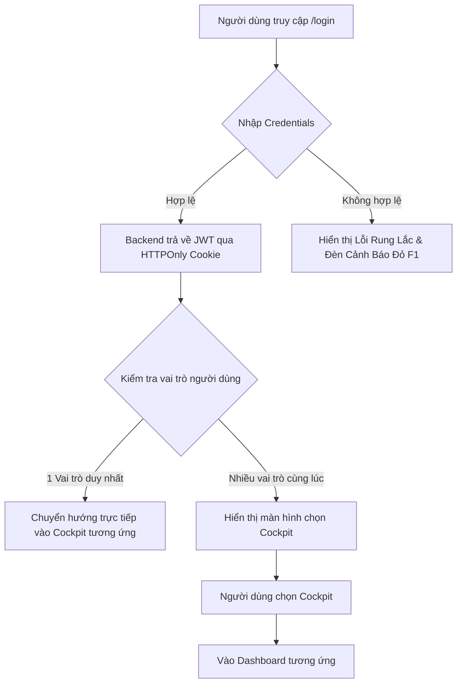

# BẢN THIẾT KẾ TOÀN DIỆN: HỆ THỐNG ĐĂNG NHẬP & PHÂN QUYỀN HƠN THƯỜNG (HORSETRACK)
> **Góc nhìn thực chiến từ Chuyên gia Business Analyst (BA), UI/UX Designer (DES) và Full-Stack Technical Architect.**

Tài liệu này được biên soạn nhằm cung cấp một cái nhìn chi tiết từ cấp độ nghiệp vụ (BA), giao diện (DES) đến sơ đồ kỹ thuật và mã nguồn mẫu (Full-stack Dev) để triển khai tính năng **Đăng nhập & Phân quyền (Authentication & Authorization)** cho dự án HorseTrack.

---



---

## PHẦN 1: GÓC NHÌN NGHIỆP VỤ - BUSINESS ANALYST (BA) SPECIFICATION

Hệ thống HorseTrack là một nền tảng quản lý giải đua ngựa cao cấp, có tính chất phân quyền sâu rộng. Đăng nhập không đơn thuần là xác thực danh tính, mà là **bước mở cổng kiểm soát (Race Control Entry)** để phân luồng người dùng vào các buồng lái (Cockpit) chuyên biệt.

### 1. Phân tích đối tượng & Phân quyền (Role Matrix)

Hệ thống bắt buộc phải hỗ trợ **Multi-role (Một tài khoản có thể có nhiều vai trò)**. Ví dụ: Một chủ ngựa (`owner`) cũng có thể tham gia dự đoán giải đua với tư cách người xem (`spectator`).

| Vai trò (Role) | Ký hiệu (Code) | Trang đích (Entry Path) | Mô tả Nghiệp vụ Chính | Quyền hạn Giao dịch |
| :--- | :--- | :--- | :--- | :--- |
| **Admin** | `admin` | `/admin` | Quản trị viên điều hành giải đấu, kiểm duyệt kết quả, xét duyệt vai trò. | Tuyệt đối |
| **Chủ Ngựa** | `owner` | `/owner` | Quản lý trang trại ngựa, đăng ký ngựa thi đấu, mời kị sĩ (jockey). | Quản lý Tài sản & Đăng ký |
| **Nài Ngựa** | `jockey` | `/jockey` | Nhận lời mời đua, theo dõi lịch trình thi đấu cá nhân. | Xác nhận & Xem lịch |
| **Trọng Tài** | `referee` | `/referee` | Giám sát đường đua, ghi nhận vi phạm, xác nhận kết quả đua trực tiếp. | Ghi nhận & Báo cáo |
| **Khán Giả** | `spectator` | `/spectator` | Theo dõi giải đua, xem bảng xếp hạng, đặt cược giả lập (mock bet). | Đọc dữ liệu & Dự đoán |

### 2. Luồng nghiệp vụ cốt lõi (User Flows)
1. **Luồng Đăng nhập (Sign In Flow):**
   * Người dùng nhập Email & Mật khẩu.
   * Hệ thống kiểm tra trạng thái tài khoản (`status`): Chỉ tài khoản `active` mới được phép đăng nhập. Các trạng thái khác (`inactive`, `banned`, `deleted`) sẽ bị từ chối với lý do cụ thể.
   * Nếu tài khoản sở hữu **duy nhất 1 vai trò**, chuyển hướng thẳng tới `entryPath` của vai trò đó.
   * Nếu tài khoản sở hữu **nhiều vai trò**, chuyển tiếp sang màn hình trung gian **"Cockpit Selector"** để người dùng tự chọn môi trường làm việc mong muốn cho phiên làm việc đó.
2. **Luồng Giữ phiên (Session Persistence):**
   * Sử dụng cặp token song song: **Access Token** (hạn dùng ngắn - 1 giờ) và **Refresh Token** (hạn dùng dài - 30 ngày).
   * Cơ chế tự động làm mới session mà không gây gián đoạn trải nghiệm người dùng (Silent Refresh).
3. **Luồng Đăng xuất (Sign Out Flow):**
   * Thu hồi Token phía Backend (hủy bỏ Refresh Token trong DB nếu có lưu trữ).
   * Xóa sạch cookie an toàn ở Client.
   * Chuyển hướng người dùng về trang Landing Page công cộng.

### 3. Chính sách Bảo mật Bắt buộc (Security Threat Model)
> [!IMPORTANT]
> **Không bao giờ lưu trữ JWT Access Token trong `localStorage` hay `sessionStorage`.** Việc này khiến ứng dụng dễ bị tấn công XSS (Cross-Site Scripting) đánh cắp phiên.

* **Giải pháp chuẩn Enterprise:** 
  * Cả Access Token và Refresh Token đều phải được ghi nhận dưới dạng **HTTPOnly Cookie** kèm các cờ an toàn: `Secure=true` (chỉ truyền qua HTTPS), `SameSite=Strict` (chống tấn công CSRF), và `HttpOnly` (Javascript phía Client không thể đọc được).
* **Kiểm soát Tần suất (Rate Limiting):**
  * Tối đa 5 lần thử đăng nhập sai liên tiếp trong 15 phút cho một IP/Email. Nếu vượt quá, khóa tạm thời tính năng đăng nhập của tài khoản/IP đó trong 15 phút để chống tấn công brute-force.
* **Mật khẩu mật mã:**
  * Bắt buộc mã hóa một chiều bằng thuật toán **bcrypt** với salt round tối thiểu là 10 trước khi lưu trữ trong MongoDB.

---

## PHẦN 2: THIẾT KẾ TRẢI NHỆM - UI/UX DESIGNER (DES) BLUEPRINT

Giao diện đăng nhập của HorseTrack được lấy cảm hứng từ **buồng lái xe đua F1 và trung tâm điều hành giải đua (Race Control Tower)**. Thiết kế phải mang lại cảm giác công nghệ cao, tốc độ, mạnh mẽ nhưng vô cùng tinh tế, sang trọng.

### 1. Ý tưởng Giao diện Mới: "Split-Screen Telemetry Portal"
Thay vì một form đăng nhập đơn điệu nằm giữa trang, chúng ta thiết kế giao diện dạng **Split-screen (2 cột)** trên Desktop (độ rộng từ 1024px trở lên), tự động co giãn về 1 cột trên Mobile.

```
+------------------------------------------+------------------------------------------+
|                 CỘT TRÁI                 |                 CỘT PHẢI                 |
|       (HUD Telemetry & Race Control)     |             (Glassmorphic Form)          |
|                                          |                                          |
|  * 5 Đèn LED Đỏ F1 đếm ngược (Animation) |  * Logo HorseTrack phát sáng đỏ neon     |
|  * Bảng dòng chảy dữ liệu tốc độ đua     |  * Tiêu đề: ENTER RACE CONTROL           |
|  * Trạng thái Live Server: 99.9% Uptime  |  * Form nhập liệu kính mờ viền đỏ neon   |
|  * Biểu đồ đường chạy vector lập lòe     |  * Nút bấm dạng nhộng (Pill) đỏ F1 rực   |
|                                          |                                          |
+------------------------------------------+------------------------------------------+
```

### 2. Chi tiết Cột Trái: Bảng Điều Khiển Telemetry (Chỉ hiển thị trên PC/Tablet)
* **Visual Concept:** Mô phỏng màn hình phân tích dữ liệu của đội đua F1 Mercedes/Red Bull.
* **Hiệu ứng Đèn Xuất phát F1 (Start Lights Animation):** 
  * Thiết kế 5 hình tròn màu xám tối. Khi tải trang, từng đèn một sẽ chuyển sang màu đỏ rực rỡ cách nhau `0.3 giây`. 
  * Khi cả 5 đèn đã sáng đỏ, chúng giữ nguyên trong `1 giây` rồi đồng loạt tắt phụt kèm theo hiệu ứng nhấp nháy chữ **"LIGHTS OUT & AWAY WE GO"** (Báo hiệu hệ thống sẵn sàng tiếp nhận người dùng).
* **Dòng chảy dữ liệu (Data Ticker):** Một luồng văn bản nhỏ, chạy liên tục hiển thị trạng thái hệ thống: `SYS.LOC: 127.0.0.1`, `RACE.STATUS: PRE-GRID`, `WEATHER: DRY 28°C`, `SESSION: AUTH_INITIALIZED`.
* **Biểu đồ Vector:** Một bản đồ đường đua ngựa vẽ bằng đường SVG mảnh màu Teal (`#067E6A`) nhấp nháy nhẹ (pulse effect).

### 3. Chi tiết Cột Phải: Form Đăng Nhập Kính Mờ (Glassmorphism Form)
* **Background Card:** Sử dụng màu đen bóng đêm `#111118` với độ trong suốt 92% (`bg-[#111118]/92`), áp dụng bộ lọc mờ nền (`backdrop-blur-xl`).
* **Accent Line:** Phía trên cùng của thẻ có một đường viền mảnh (1px) gradient chuyển màu từ trong suốt sang đỏ F1 (`#E10600`) rồi lại trong suốt, tạo cảm giác laser cắt ngang.
* **Trạng thái Trường Nhập liệu (Input Field States):**
  * *Mặc định:* Nền tối trong suốt, viền xám mờ (`border-white/10`).
  * *Khi Focus:* Viền chuyển sang đỏ F1 rực rỡ (`border-[#E10600]`), bóng đổ nhạt màu đỏ lan tỏa rộng 4px (`shadow-[0_0_12px_rgba(225,6,0,0.25)]`). Label bay lên phía trên thu nhỏ 15% diện tích.
  * *Khi có Lỗi:* Viền chuyển sang màu đỏ cảnh báo, ô nhập liệu rung lắc nhẹ (Shake Animation) sang trái/phải 3 lần để thu hút sự chú ý.
* **Nút bấm Đăng nhập (Primary CTA Button):**
  * Thiết kế bo tròn tuyệt đối (`rounded-full`), cao 44px trên mobile để dễ ấn bằng ngón cái.
  * Màu nền đỏ tươi F1 (`#E10600`). Khi rê chuột (hover), nền tối dần sang `#B80500` và phóng to nhẹ 1.02 lần (`scale-[1.02]`) bằng hiệu ứng transition mượt mà (`transition-all duration-300`).
  * *Trạng thái Loading:* Nút bấm chuyển sang màu xám đen, xuất hiện một vòng tròn spinner quay đều mô phỏng bánh xe đang quay tốc độ cao.

### 4. Màn hình Chọn Cockpit (Cockpit Selector Overlay)
Khi đăng nhập thành công một tài khoản có nhiều vai trò, một màn hình phủ lớp kính mờ tối (`backdrop-blur-md bg-black/60`) hiện ra:
* Tiêu đề lớn: **"CHOOSE YOUR COCKPIT"** dùng font **Formula1** viết hoa đậm chất thể thao.
* Hiển thị danh sách các vai trò dưới dạng **Thẻ Buồng Lái (Cockpit Cards)** xếp hàng ngang:
  * Mỗi thẻ đại diện cho một vai trò, có Icon tương ứng (Crown cho Admin, Shield cho Owner, Trophy cho Jockey...).
  * Thẻ có hiệu ứng hover phát sáng viền neon theo màu đặc trưng của vai trò đó (đỏ cho Admin, teal cho Owner).
  * Nhấp chọn vai trò nào sẽ có hiệu ứng trượt mượt mà (slide out) sang trang Dashboard tương ứng.

---

## PHẦN 3: ĐỒNG BỘ FULL-STACK DEV IMPLEMENTATION

Dưới đây là kiến trúc tích hợp và mã nguồn chi tiết để nhóm lập trình viên Full-stack bắt tay vào cài đặt ngay, đồng bộ hoàn toàn giữa Backend (NestJS) và Frontend (Next.js 14 App Router).

### 1. Kiến trúc luồng Token & Session Security

```
[ Next.js Client ]                                           [ NestJS Backend ]
       |                                                            |
       | ----- POST /auth/login (Email, Password) ----------------> |
       |                                                            | --- Xác thực DB, băm mật khẩu
       | <---- Set-Cookie: access_token & refresh_token (HttpOnly) - | --- Trả về thông tin User
       |                                                            |
(Trang được bảo vệ)                                                 |
       | ----- GET /auth/me (Tự động kèm Cookie) -----------------> |
       | <---- Trả về thông tin User & Quyền ---------------------- |
```

---

### 2. Thiết kế Cơ sở dữ liệu (Mongoose/MongoDB Schema)
Đảm bảo Schema người dùng lưu trữ đúng cấu trúc phân quyền và trạng thái hoạt động.

```typescript
// be/src/users/schemas/user.schema.ts
import { Prop, Schema, SchemaFactory } from '@nestjs/mongoose';
import { Document } from 'mongoose';

export type UserDocument = User & Document;

export enum UserStatus {
  ACTIVE = 'active',
  INACTIVE = 'inactive',
  BANNED = 'banned',
}

export enum RoleName {
  ADMIN = 'admin',
  OWNER = 'owner',
  JOCKEY = 'jockey',
  REFEREE = 'referee',
  SPECTATOR = 'spectator',
}

@Schema({ timestamps: true })
export class User {
  @Prop({ required: true })
  fullName!: string;

  @Prop({ required: true, unique: true })
  email!: string;

  @Prop({ required: true, select: false }) // Bảo mật: Không bao giờ trả về password khi SELECT thông thường
  passwordHash!: string;

  @Prop({ type: [String], enum: RoleName, default: [RoleName.SPECTATOR] })
  roles!: RoleName[];

  @Prop({ required: true, enum: UserStatus, default: UserStatus.ACTIVE })
  status!: UserStatus;
}

export const UserSchema = SchemaFactory.createForClass(User);
```

---

### 3. Phía Backend (NestJS Controller & Service)
Backend cần xử lý việc đính kèm JWT Token trực tiếp vào Cookie của phản hồi HTTP (HTTPOnly Cookie) để tăng độ bảo mật tối đa.

#### Cấu hình Authentication Service:
```typescript
// be/src/auth/auth.service.ts
import { Injectable, UnauthorizedException } from '@nestjs/common';
import { JwtService } from '@nestjs/jwt';
import { Response } from 'express';
import { UsersService } from '../users/users.service';
import { UserDocument } from '../users/schemas/user.schema';

@Injectable()
export class AuthService {
  constructor(
    private usersService: UsersService,
    private jwtService: JwtService,
  ) {}

  // Tạo và thiết lập Cookie chứa JWT
  setAuthCookies(res: Response, user: UserDocument) {
    const payload = { sub: user._id, email: user.email, roles: user.roles };
    
    const accessToken = this.jwtService.sign(payload, { expiresIn: '1h' });
    const refreshToken = this.jwtService.sign(payload, { expiresIn: '30d' });

    // Cấu hình cookie an toàn
    const cookieOptions = {
      httpOnly: true,
      secure: process.env.NODE_ENV === 'production', // Chỉ bật trên production dùng HTTPS
      sameSite: 'strict' as const,
      path: '/',
    };

    // Đính kèm Access Token vào cookie (sống 1 giờ)
    res.cookie('access_token', accessToken, {
      ...cookieOptions,
      maxAge: 60 * 60 * 1000,
    });

    // Đính kèm Refresh Token vào cookie (sống 30 ngày)
    res.cookie('refresh_token', refreshToken, {
      ...cookieOptions,
      maxAge: 30 * 24 * 60 * 60 * 1000,
    });
  }

  // Xóa sạch cookie khi đăng xuất
  clearAuthCookies(res: Response) {
    const cookieOptions = {
      httpOnly: true,
      secure: process.env.NODE_ENV === 'production',
      sameSite: 'strict' as const,
      path: '/',
    };
    res.clearCookie('access_token', cookieOptions);
    res.clearCookie('refresh_token', cookieOptions);
  }
}
```

#### Cấu hình API Controller để làm việc với Cookie:
```typescript
// be/src/auth/auth.controller.ts
import { Controller, Post, Body, Res, Req, HttpCode, HttpStatus, UseGuards } from '@nestjs/common';
import { Response, Request } from 'express';
import { AuthService } from './auth.service';
import { LoginDto } from './dto/login.dto';
import { LocalAuthGuard } from './guards/local-auth.guard'; // Sử dụng Passport Local

@Controller('auth')
export class AuthController {
  constructor(private readonly authService: AuthService) {}

  @Post('login')
  @UseGuards(LocalAuthGuard)
  @HttpCode(HttpStatus.OK)
  async login(
    @Req() req: any,
    @Res({ passthrough: true }) res: Response
  ) {
    // req.user được điền tự động bởi Passport Local strategy sau khi đối khớp email/mật khẩu
    const user = req.user;
    
    if (user.status !== 'active') {
      throw new UnauthorizedException('Tài khoản của bạn đã bị khóa hoặc chưa kích hoạt.');
    }

    // Thiết lập cookie an toàn chứa token
    this.authService.setAuthCookies(res, user);

    // Chỉ trả về thông tin user thô cho client, không gửi token thô ra ngoài body
    return {
      success: true,
      user: {
        id: user._id,
        fullName: user.fullName,
        email: user.email,
        roles: user.roles,
      }
    };
  }

  @Post('logout')
  @HttpCode(HttpStatus.OK)
  async logout(@Res({ passthrough: true }) res: Response) {
    this.authService.clearAuthCookies(res);
    return { success: true, message: 'Đăng xuất thành công.' };
  }
}
```

---

### 4. Phía Frontend (Next.js 14 App Router + Cookies)

Với Next.js, chúng ta có thể bảo vệ các tuyến đường (Protected Routes) ngay từ cấp độ máy chủ bằng cách sử dụng **Middleware** để quét cookie trước khi trang kịp hiển thị. Việc này giúp loại bỏ hoàn toàn hiện tượng nhấp nháy giao diện (no client-side auth flash).

#### Lớp bọc Xác thực phía Client (AuthContext):
```typescript
// fe/features/auth/context/auth-context.tsx
"use client";

import React, { createContext, useContext, useState, useEffect } from 'react';
import { useRouter } from 'next/navigation';

type User = {
  id: string;
  fullName: string;
  email: string;
  roles: string[];
};

type AuthContextType = {
  user: User | null;
  isLoading: boolean;
  login: (email: string, password: string) => Promise<User>;
  logout: () => Promise<void>;
};

const AuthContext = createContext<AuthContextType | undefined>(undefined);

export function AuthProvider({ children }: { children: React.ReactNode }) {
  const [user, setUser] = useState<User | null>(null);
  const [isLoading, setIsLoading] = useState(true);
  const router = useRouter();

  // Kiểm tra phiên đăng nhập hiện tại khi khởi chạy ứng dụng
  useEffect(() => {
    async function checkSession() {
      try {
        const res = await fetch('/api/auth/me'); // Hướng qua API route nội bộ Next.js hoặc proxy trực tiếp
        if (res.ok) {
          const data = await res.json();
          setUser(data.user);
        }
      } catch (err) {
        console.error('Không tìm thấy phiên đăng nhập hoạt động.');
      } finally {
        setIsLoading(false);
      }
    }
    checkSession();
  }, []);

  const login = async (email: string, password: string): Promise<User> => {
    setIsLoading(true);
    try {
      const res = await fetch('/api/auth/login', {
        method: 'POST',
        headers: { 'Content-Type': 'application/json' },
        body: JSON.stringify({ email, password }),
      });

      if (!res.ok) {
        const errorData = await res.json();
        throw new Error(errorData.message || 'Sai thông tin đăng nhập.');
      }

      const data = await res.json();
      setUser(data.user);
      return data.user;
    } finally {
      setIsLoading(false);
    }
  };

  const logout = async () => {
    setIsLoading(true);
    try {
      await fetch('/api/auth/logout', { method: 'POST' });
      setUser(null);
      router.push('/login');
    } finally {
      setIsLoading(false);
    }
  };

  return (
    <AuthContext.Provider value={{ user, isLoading, login, logout }}>
      {children}
    </AuthContext.Provider>
  );
}

export function useAuth() {
  const context = useContext(AuthContext);
  if (!context) throw new Error('useAuth phải được dùng trong AuthProvider');
  return context;
}
```

#### Middleware bảo vệ các Dashboard (Next.js Server Side Guard):
Tệp tin `middleware.ts` nằm ở thư mục gốc của dự án `fe` để quét các trang trước khi hiển thị.

```typescript
// fe/middleware.ts
import { NextResponse } from 'next/server';
import type { NextRequest } from 'next/server';

export function middleware(request: NextRequest) {
  const accessToken = request.cookies.get('access_token')?.value;
  const { pathname } = request.nextUrl;

  // Nếu truy cập các trang Dashboard yêu cầu xác thực
  const isDashboardRoute = 
    pathname.startsWith('/admin') || 
    pathname.startsWith('/owner') || 
    pathname.startsWith('/jockey') || 
    pathname.startsWith('/referee');

  if (isDashboardRoute && !accessToken) {
    // Chưa đăng nhập -> Chuyển hướng ngay lập tức về trang login
    const loginUrl = new URL('/login', request.url);
    // Lưu lại trang đang muốn truy cập để sau khi đăng nhập xong chuyển hướng ngược lại
    loginUrl.searchParams.set('redirect', pathname); 
    return NextResponse.redirect(loginUrl);
  }

  // Nếu đã đăng nhập mà cố tình truy cập lại trang /login hoặc /register
  if ((pathname === '/login' || pathname === '/register') && accessToken) {
    // Chuyển hướng người dùng về trang chủ tạm thời
    return NextResponse.redirect(new URL('/', request.url));
  }

  return NextResponse.next();
}

export const config = {
  // Bộ lọc các đường dẫn sẽ chạy qua middleware để tối ưu hiệu năng
  matcher: [
    '/admin/:path*',
    '/owner/:path*',
    '/jockey/:path*',
    '/referee/:path*',
    '/login',
    '/register'
  ],
};
```

---

## TỔNG KẾT & KẾ HOẠCH TRIỂN KHAI (ROADMAP)

Dành cho **Full-stack Developer**, dưới đây là thứ tự các bước cần làm để chuyển đổi từ bản thiết kế này thành tính năng hoàn thiện:

1. **Bước 1: Backend Setup (Database & APIs)**
   * Định nghĩa `UserSchema` với vai trò và trạng thái thích hợp trong `be/src/users/schemas/user.schema.ts`.
   * Cấu hình `@nestjs/jwt` cấp phát mã hóa với khóa bí mật an toàn.
   * Viết API đăng nhập có chức năng sinh JWT và ghim vào cookie phản hồi (`res.cookie`).
   * Sử dụng Postman/Swagger để kiểm nghiệm API `POST /auth/login` và kiểm tra mục **Cookies** xem các cờ `HttpOnly`, `Secure` đã bật đúng chưa.

2. **Bước 2: Client Auth Management (Next.js Session)**
   * Tạo tệp tin `middleware.ts` ở Client để điều hướng tự động khi không có `access_token` cookie.
   * Tạo `AuthProvider` bọc ngoài dự án để lưu trữ và phân phối trạng thái người dùng đăng nhập cho toàn bộ component con.

3. **Bước 3: UX/UI Redesign (Sửa đổi giao diện theo chuẩn thiết kế DES)**
   * Cải tiến `fe/app/(auth)/layout.tsx` để bổ sung cột trái hiển thị **HUD Telemetry** và hiệu ứng đèn xuất phát F1.
   * Sửa đổi `fe/features/auth/components/login-form.tsx` để kết nối hàm `login` từ `useAuth()`.
   * Tích hợp hiệu ứng rung lắc (Shake) khi nhập sai mật khẩu bằng các class Tailwind.

4. **Bước 4: Màn hình chọn Cockpit đa năng (Cockpit Selector)**
   * Xây dựng giao diện chọn Cockpit dạng lưới mờ khi người dùng có nhiều vai trò trong mảng `roles` sau khi gọi API thành công.
