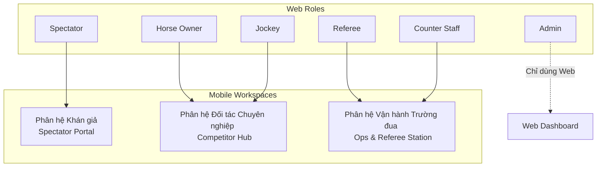
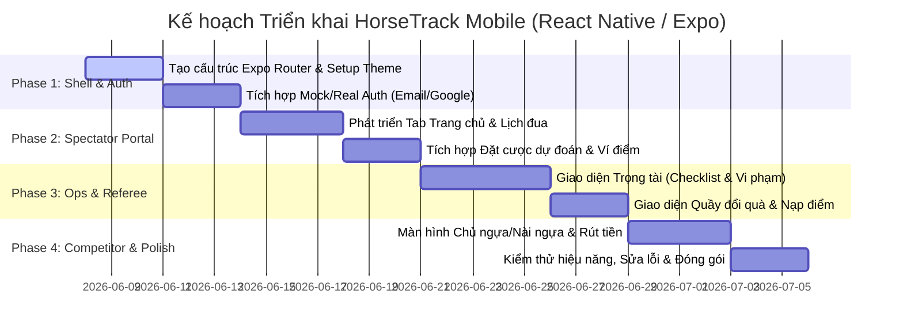

# Đề xuất Thiết kế & Kế hoạch Phát triển Phân hệ Mobile (HorseTrack Mobile App Proposal)

**Vai trò:** Business Analyst (BA), Project Manager (PM), và UI/UX Designer (DES)  
**Công nghệ:** Expo (React Native) + TypeScript + Expo Router  
**Chủ đề:** Hệ thống quản lý giải đua ngựa (Horse Racing Tournament Management)

---

## 1. Mục tiêu Phân hệ Mobile

Ứng dụng di động **HorseTrack Mobile** được định hướng là một phiên bản **nhẹ (lightweight), tối ưu hóa thao tác tại thực địa (on-the-field)** và **gia tăng tương tác thời gian thực (real-time interaction)**. 
Trái ngược với phiên bản Web Dashboard tập trung vào các bảng biểu dữ liệu lớn và các tính năng cấu hình hệ thống nặng, ứng dụng Mobile sẽ tập trung vào sự tiện lợi, nhanh chóng, tối ưu hóa trải nghiệm vuốt chạm (touch-friendly) và hỗ trợ các vai trò làm việc trực tiếp tại trường đua.

---

## 2. Phân tích Nghiệp vụ & Đánh giá Đưa xuống Mobile (BA)

Dưới đây là bảng đánh giá mức độ cần thiết của các vai trò (Roles) hiện có từ Web xuống Mobile:

| Vai trò (Web) | Mức độ ưu tiên trên Mobile | Lý do & Đánh giá Nghiệp vụ |
| :--- | :--- | :--- |
| **Spectator** (Khán giả) | **P0 (Bắt buộc)** | Khán giả là đối tượng sử dụng di động nhiều nhất để xem giải đua trực tiếp tại khán đài, thực hiện dự đoán (Predictions) nhanh trước giờ chạy và theo dõi biến động số dư ví điểm thưởng. |
| **Race Referee** (Trọng tài) | **P0 (Bắt buộc)** | Trọng tài làm việc trực tiếp dưới sân cát/trường đua. Họ cần thiết bị di động gọn nhẹ để điểm danh nài ngựa (Jockey roll-call), kiểm tra y tế ngựa trước đua (Pre-race check), ghi lỗi vi phạm (Violations) khi đang xem đua, và xác nhận kết quả chạy (Confirm result) ngay tại vạch đích. |
| **Counter Staff** (Nhân viên quầy) | **P1 (Quan trọng)** | Nhân viên quầy cần thiết bị di động (hoặc tablet) để quét/nhập mã đổi thưởng trực tiếp (`RWD-XXXXXX`) cho khách hàng nhận quà vật lý và thực hiện nạp tiền mặt nhanh cho Spectator tại quầy. |
| **Horse Owner** (Chủ ngựa) | **P2 (Trung bình)** | Chủ ngựa cần theo dõi trạng thái đăng ký của ngựa, gửi lời mời Jockey, và rút tiền (Cashout). Những tính năng này hoàn toàn có thể làm trên Mobile để nhận thông báo (Notification) tức thời. |
| **Jockey** (Nài ngựa) | **P2 (Trung bình)** | Nài ngựa cần xem lịch đua cá nhân và duyệt/từ chối lời mời cưỡi ngựa từ các Chủ ngựa ngay trên điện thoại khi đang chuẩn bị ở khu vực kỹ thuật. |
| **Admin** (Quản trị viên) | **P3 (Không đưa xuống)** | Các tác vụ của Admin (quản lý user, cấu hình tournament/race, xem audit log hệ thống, duyệt rút tiền hàng loạt) đòi hỏi màn hình lớn, nhập liệu phức tạp. Để ứng dụng di động đơn giản và bảo mật, **Admin sẽ chỉ sử dụng Web Dashboard**. |

---

## 3. Chiến lược Gộp quyền trên Mobile (Consolidation Strategy)

Để giảm thiểu chi phí phát triển (Development Cost), đơn giản hóa cấu trúc định tuyến (Expo Router), và tối ưu hóa bộ nhớ thiết bị, chúng ta sẽ **gộp 6 quyền trên Web thành 3 Phân hệ Giao diện (Workspaces) chính trên Mobile**:



### Chi tiết 3 Phân hệ Mobile:

#### Phân hệ 1: Spectator Portal (Khán giả công cộng)
* **Đối tượng:** Khách vãng lai chưa đăng nhập, Khán giả đã đăng nhập (Spectator).
* **Đặc điểm:** Không yêu cầu quyền nghiệp vụ cao. Chức năng chính là xem và giải trí.
* **Các chức năng chính:**
  * Xem danh sách giải đấu (Tournaments) và lịch đua (Races).
  * Xem trực tiếp trạng thái đua (Live Race Monitor).
  * Dự đoán kết quả (Prediction / Betting points) kèm đồng hồ đếm ngược khóa cổng.
  * Quản lý ví điểm thưởng cá nhân (Ví nạp demo, lịch sử biến động điểm).

#### Phân hệ 2: Competitor Hub (Hội đua chuyên nghiệp - Gộp Owner & Jockey)
* **Đối tượng:** Chủ ngựa (Horse Owner) và Nài ngựa (Jockey).
* **Tại sao gộp được?** Cả hai vai trò này đều là các bên tham gia trực tiếp vào cuộc đua (Competitor), có mối quan hệ tương tác trực tiếp (Owner mời Jockey, Jockey nhận lời mời), sử dụng chung một cơ chế chia thưởng (70% Owner / 30% Jockey) và chung quy trình rút tiền đổi điểm thưởng (`walletApi.requestCashout`).
* **Các chức năng chính:**
  * **Lịch đua chuyên nghiệp (Professional Schedule):** Xem các chặng đua có ngựa của mình tham gia (đối với Owner) hoặc các chặng mình được phân công cưỡi (đối với Jockey).
  * **Hộp thư mời (Invitation Inbox):** Chủ ngựa gửi lời mời Jockey; Jockey nhấn Đồng ý/Từ chối trực tiếp từ màn hình thông báo.
  * **Quản lý danh sách Ngựa (My Horses):** Chủ ngựa xem danh sách ngựa cá nhân, trạng thái kiểm duyệt ngựa của Admin, và gửi đăng ký ngựa vào Race.
  * **Ví thu nhập & Đổi thưởng (Competitor Wallet):** Theo dõi tiền thưởng được cộng trực tiếp từ cơ chế chia 70/30 sau khi kết quả được công bố (`PUBLISHED`). Gửi yêu cầu rút tiền đổi điểm (Cashout) về quầy giao dịch.

#### Phân hệ 3: Ops & Referee Station (Vận hành & Trọng tài - Gộp Referee & Counter Staff)
* **Đối tượng:** Trọng tài (Referee) và Nhân viên quầy (Counter Staff).
* **Tại sao gộp được?** Cả hai vai trò này đều là nhân sự thuộc Ban tổ chức vận hành tại chỗ (Operations Staff). Họ cần các tính năng tác nghiệp nhanh trên hiện trường. Gộp chung vào một phân hệ vận hành giúp ứng dụng quản lý phân quyền gọn gàng dưới dạng "Nhân sự Vận hành".
* **Các chức năng chính:**
  * **Trạm Trọng tài (Referee Station):**
    * Điểm danh Jockey, xác thực y tế/thiết bị trước đua (Pre-race Check).
    * Ghi nhận vi phạm thời gian thực (Violation Logging - Minor/Major/Critical) với nút bấm nhanh.
    * Nhập kết quả đua thử nghiệm (Race Result simulation & entry) và bấm xác nhận (Confirm) gửi lên hệ thống.
  * **Quầy Đổi quà & Giao dịch (Redemption Counter):**
    * Đối soát mã đổi thưởng (`RWD-XXXXXX`) do Khán giả/Đối tác cung cấp để phát quà vật lý.
    * Nạp tiền mặt trực tiếp vào ví điểm của Khán giả (Deposit simulation) để khán giả tham gia dự đoán tại sân.

---

## 4. Thiết kế Luồng & Giao diện Mobile (DES)

### 4.1 Cấu trúc Định tuyến Thư mục (Expo Router Directory Structure)

Hệ thống định tuyến của ứng dụng Mobile sẽ sử dụng cấu trúc thư mục của **Expo Router** như sau:

```text
mobi/app/
├── (auth)/                    # Phân hệ Xác thực
│   ├── login.tsx              # Đăng nhập (Email, Google)
│   └── register.tsx           # Đăng ký tài khoản
├── (tabs)/                    # Layout Tab chính (mặc định cho Spectator)
│   ├── _layout.tsx            # Cấu hình Bottom Tab Bar
│   ├── index.tsx              # Tab 1: Trang chủ / Giải đấu đang diễn ra
│   ├── explore.tsx            # Tab 2: Lịch đua / Kết quả đua đã công bố
│   ├── wallet.tsx             # Tab 3: Ví điểm & Dự đoán của tôi
│   └── profile.tsx            # Tab 4: Hồ sơ cá nhân & Chuyển đổi Phân hệ
├── competitor/                # Phân hệ Đối tác Chuyên nghiệp (Owner/Jockey)
│   ├── _layout.tsx            # Drawer hoặc Stack Navigation riêng
│   ├── dashboard.tsx          # Tổng quan lịch đua & thu nhập
│   ├── invitation-inbox.tsx   # Danh sách lời mời (chấp nhận/từ chối)
│   ├── my-horses.tsx          # Quản lý & Đăng ký ngựa thi đấu (chỉ hiển thị với Owner)
│   └── cashout-request.tsx    # Gửi yêu cầu rút điểm thưởng
├── operations/                # Phân hệ Vận hành (Referee/Counter Staff)
│   ├── _layout.tsx            # Stack Navigation
│   ├── referee/
│   │   ├── assigned-races.tsx # Danh sách cuộc đua được phân công
│   │   ├── pre-race.tsx       # Checklist điểm danh & y tế ngựa
│   │   ├── violation-log.tsx  # Ghi nhanh vi phạm thời gian thực
│   │   └── result-entry.tsx   # Nhập thời gian đua nháp & Xác nhận
│   └── counter/
│       ├── scan.tsx           # Quét mã đổi quà (Camera / Nhập tay)
│       └── quick-deposit.tsx  # Nạp điểm nhanh cho khách hàng
├── _layout.tsx                # Root layout (Theme provider, Auth context)
└── modal.tsx                  # Modal hiển thị thông tin chi tiết nhanh
```

### 4.2 Thiết kế UI/UX & Ngôn ngữ Đồ họa

Nhằm tạo cảm giác đồng bộ và đẳng cấp như F1 Web Dashboard, **HorseTrack Mobile** sẽ áp dụng chính xác bộ quy tắc thiết kế từ `design.md` nhưng điều chỉnh phù hợp với hành vi di động:

* **Dark Motorsport Mode:** Sử dụng màu nền chủ đạo là Championship Black (`#1C1C25`) kết hợp các thẻ thông tin có màu nền tối (`#15151E`). Màu chữ chính là Trắng (`#FFFFFF`) để đạt độ tương phản tối đa.
* **F1 Red Accent (`#E10600`):** Chỉ áp dụng cho các nút hành động chính (Primary CTA) như: "Xác nhận kết quả", "Đặt cược ngay", "Ghi vi phạm", "Quét mã đổi quà".
* **Touch Target & Spacing (Quy tắc Ngón tay):**
  * Tất cả các nút tương tác (nút bấm, ô nhập liệu, thẻ danh sách) phải có chiều cao tối thiểu là **44px** trên điện thoại (đảm bảo không bấm trượt).
  * Khoảng cách giữa các phần tử tối thiểu là **8px** (scale 4px).
* **Hạn chế Glow/Shadow:** Để đảm bảo ứng dụng chạy mượt mà trên các dòng điện thoại cấu hình thấp, chúng ta sẽ loại bỏ hiệu ứng đổ bóng mờ ảo (glow) và các bộ lọc blur phức tạp. Thay vào đó, sử dụng các đường viền mảnh (`borderWidth: 1`, `borderColor: '#303037'`) để phân tách các khối thông tin.
* **Giao diện Trọng tài Thân thiện Thực địa:**
  * Màn hình ghi vi phạm (Violation Logging) sẽ có các nút bấm cực kỳ to cho 3 cấp độ: `MINOR (+3s)`, `MAJOR (+6s)`, `CRITICAL (+12s)` hiển thị ngay cạnh tên của từng Horse/Jockey đang chạy. Trọng tài chỉ cần bấm 1 chạm để ghi lỗi mà không cần gõ bàn phím.

---

## 5. Bản đồ Chức năng và Tích hợp API (BA & PM)

Dưới đây là chi tiết tích hợp từ Backend (thông qua các API đã xây dựng sẵn trên Web) vào các màn hình Mobile:

### 5.1 Phân hệ Khán giả (Spectator Portal)
* **API tích hợp:**
  * Lấy danh sách giải đấu: `tournamentsApi.list()`
  * Lấy thông tin chi tiết giải & cuộc đua: `racesApi.listByTournament(tournamentId)`
  * Đặt cược dự đoán: `predictionsApi.create({ raceId, predictedHorseId, betPoints })`
  * Xem lịch sử dự đoán: `predictionsApi.listMyPredictions()`
  * Xem ví điểm thưởng: `walletApi.myHistory()`
* **Luồng UX Đơn giản:** Khán giả mở app -> Thấy ngay giải đấu đang diễn ra -> Bấm vào xem trực tiếp trạng thái các ngựa -> Đặt dự đoán trước giờ đua (hệ thống tự động lock khi quá giờ) -> Xem kết quả trực quan ngay sau khi kết quả được công bố.

### 5.2 Phân hệ Đối tác (Competitor Hub)
* **API tích hợp:**
  * Xem thông tin ví & thu nhập: `rewardPointLedgerApi.myHistory()`, `rewardPointLedgerApi.myBalance()`
  * Yêu cầu rút tiền: `walletApi.requestCashout({ pointsToRedeem })`
  * Quản lý ngựa: `horsesApi.list()` (Lọc theo owner đã đăng nhập)
  * Đăng ký giải đua: `registrationsApi.list()`, đăng ký ngựa vào race (sử dụng cổng đăng ký).
  * Nhận/Xác nhận Jockey Assignment: Đồng ý hoặc từ chối thông qua inbox.
* **Luồng UX Đơn giản:** Chủ ngựa/Nài ngựa đăng nhập -> Hệ thống phát hiện vai trò và hiển thị nút chuyển sang **Competitor Hub** ở Profile -> Vào trang quản lý ví xem điểm tích lũy và thu nhập từ giải thưởng -> Tạo mã rút tiền nhanh để trình ra quầy nhận tiền mặt.

### 5.3 Phân hệ Vận hành (Ops & Referee Station)
* **API tích hợp:**
  * Lấy danh sách đua được phân công: `refereeAssignmentsApi.listByRace(raceId)`
  * Ghi nhận Pre-race check: Cập nhật trạng thái check cho từng horse.
  * Thêm lỗi vi phạm: Gọi API tạo lỗi vi phạm gắn vào race/horse (`RaceViolation`).
  * Giả lập & Xác nhận kết quả: Gửi kết quả nháp, hệ thống tự động cộng giây phạt vi phạm và trả về bảng xếp hạng (Ranking), Referee bấm xác nhận (Confirm result).
  * Đối soát mã đổi thưởng: `walletApi.processCashout(cashoutId, 'PAID')` hoặc đối soát dựa trên mã code rút tiền `walletApi.allCashouts()` lọc theo redemptionCode.
  * Nạp tiền mặt: `walletApi.depositForUser(userId, amount)`.
* **Luồng UX Đơn giản:** Trọng tài/Nhân viên quầy đăng nhập -> Chuyển đổi phân hệ sang **Operations** -> Chọn cuộc đua sắp diễn ra -> Thực hiện tích chọn Pre-race Check -> Vào màn hình đua để ghi lỗi trực tiếp -> Cuối trận bấm "Hoàn tất cuộc đua" -> Hệ thống tự động tính toán thứ hạng chung cuộc dựa trên thời gian thực chạy và các lỗi vi phạm -> Trọng tài bấm "Xác nhận kết quả".

---

## 6. Kế hoạch Phát triển & Triển khai (PM)

Dự án mobile sẽ được triển khai theo mô hình Agile/Scrum rút gọn với 4 chặng (Phases) chính, mỗi chặng kéo dài từ 5 - 7 ngày làm việc:



### 6.1 Đánh giá Rủi ro & Giải pháp giảm thiểu (Risk Management)

1. **Rủi ro 1: Hiệu năng trên thiết bị di động yếu**
   * *Giải pháp:* Hạn chế tối đa sử dụng thư viện hiệu ứng nặng. Tận dụng tối đa `FlatList` của React Native thay vì dùng `ScrollView` thông thường để kết xuất các bảng danh sách đua hoặc danh sách ngựa lớn.
2. **Rủi ro 2: Khó khăn trong việc quét mã vạch (Barcode/QR Code) của nhân viên quầy trên Web view hoặc máy ảo**
   * *Giải pháp:* Thiết kế giao diện đổi thưởng có cả 2 chế độ: Quét camera (sử dụng thư viện `expo-camera` ở Phase sau) và Nhập tay mã code `RWD-XXXXXX` (sử dụng TextInput thông thường). Trong giai đoạn MVP này, ưu tiên hoàn thành tính năng **Nhập tay mã code** trước để đảm bảo hệ thống luôn vận hành được và dễ test trên mọi máy ảo.
3. **Rủi ro 3: Trùng lịch đua của Jockey**
   * *Giải pháp:* Hệ thống phía Backend đã có ràng buộc nghiệp vụ chặn Jockey tham gia các Race trùng giờ. Phía Mobile chỉ cần hiển thị thông báo lỗi rõ ràng từ API trả về khi người dùng thực hiện thao tác.

---

## 7. Đề xuất Bước tiếp theo (Next Action Steps)

Để hiện thực hóa đề xuất này, tôi kiến nghị chúng ta sẽ khởi động **Phase 1** ngay lập tức bằng cách:
1. Tạo file cấu trúc thư mục định tuyến `app/` theo thiết kế trên Expo Router.
2. Đồng bộ hóa file `mobi/constants/theme.ts` để nạp các màu thương hiệu motorsport (`#E10600`, `#1C1C25`).
3. Tạo khung các màn hình cơ bản và triển khai luồng Đăng nhập/Phân quyền để điều hướng người dùng về đúng phân hệ giao diện tương ứng với vai trò của họ.
