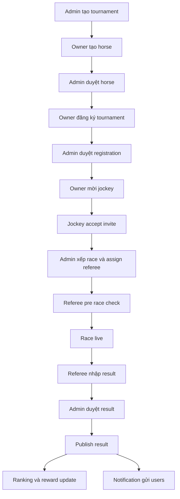
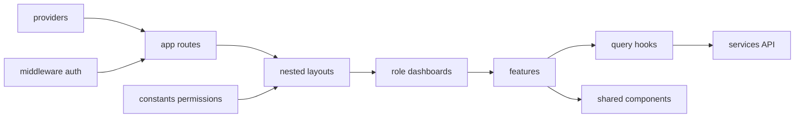

# Planning FE - Horse Racing Tournament Management System

# 1. REVIEW FRONTEND PLANNING HIỆN TẠI

Nguồn đã đọc:

- `docs/topic.md`
- `docs/frontend_planning.md`
- `fe/package.json`
- `fe/app/layout.tsx`
- `fe/app/page.tsx`
- `fe/app/globals.css`

## 1.1 Điểm tốt

Planning hiện tại trong `docs/frontend_planning.md` có nhiều phần đúng với domain:

- Nhận diện đúng roles:
  - `ADMIN`
  - `HORSE_OWNER`
  - `JOCKEY`
  - `REFEREE`
  - `SPECTATOR`

- Business flow tổng quan đúng với `docs/topic.md`:
  1. Admin tạo giải đấu.
  2. Owner đăng ký ngựa.
  3. Admin duyệt đăng ký.
  4. Owner mời jockey.
  5. Jockey accept hoặc reject.
  6. Spectator dự đoán trước race.
  7. Referee kiểm tra, nhập kết quả.
  8. Admin xác nhận, công bố kết quả.
  9. Ranking, reward, notification cập nhật.

- Có phân tích theo role tương đối hợp lý:
  - Owner cần horse CRUD, tournament registration, jockey recruitment.
  - Jockey cần invitations, schedule, achievements.
  - Referee cần checklist, monitoring, result entry.
  - Spectator cần races, predictions, leaderboard.
  - Admin cần users, tournaments, approvals, rewards.

- Có nhận thức đúng về server state:
  - Planning có nhắc TanStack Query hoặc RTK Query.
  - Hướng này phù hợp vì hệ thống dashboard nhiều bảng, filter, cache, invalidation.

- Có đề cập reusable components:
  - `DataTable`
  - `StatusBadge`
  - `ConfirmModal`
  - `SearchFilterBar`
  - `HorseCard`

- Có đề cập UX states:
  - loading skeleton
  - toast error
  - status color

## 1.2 Điểm chưa hợp lý

Vấn đề lớn nhất: planning hiện tại bị lệch stack.

Trong `docs/frontend_planning.md`, tech stack ghi là MERN, ReactJS, Vite, React Router. Nhưng project thật trong `fe/package.json` là:

- Next.js App Router
- React 19
- TypeScript
- TailwindCSS 4
- Không có `react-router-dom`
- Không có Vite
- Không có CRA

=> Planning hiện tại tốt ở mặt nghiệp vụ, nhưng architecture FE chưa phù hợp project thật.

## 1.3 Architecture conflict

Conflict chính:

| Planning hiện tại                | Project thật                                                | Vấn đề                   |
| -------------------------------- | ----------------------------------------------------------- | ------------------------ |
| `src/pages`                      | Next App Router dùng `app/`                                 | sai routing model        |
| `routes/`                        | Next không cần route config kiểu SPA                        | dễ tạo architecture thừa |
| `react-router-dom`               | Next route bằng filesystem                                  | conflict trực tiếp       |
| `ProtectedRoute` HOC             | Next nên dùng `middleware.ts`, server checks, layout guards | guard sai tầng           |
| Vite                             | Next.js 16                                                  | sai build/runtime        |
| CRA-style layout                 | App Router nested layouts                                   | không tận dụng Next      |
| Client-only app mindset          | Next có Server Components                                   | mất benefit SSR/RSC      |
| `layouts/` global kiểu React SPA | Next dùng `app/(group)/layout.tsx`                          | lặp layout               |

## 1.4 Scalability issues

Nếu đi theo planning cũ:

- Route tăng nhiều → `routes/` khó maintain.
- Role dashboard tách trong `pages/` nhưng không tận dụng nested layout → duplicate sidebar/header.
- Auth guard bằng client HOC → page protected vẫn có thể flash content.
- API call đặt lẫn page/component → khó cache/invalidate.
- Business flow phức tạp như approval, invitation, race lifecycle → nếu thiếu feature boundary sẽ rối.
- Không có route groups → public/auth/dashboard khó phân tách.
- Không có clear convention cho Server Component vs Client Component.

## 1.5 Maintainability issues

- `components/` global dễ thành dumping ground.
- Không phân biệt:
  - shared UI
  - domain component
  - feature component
  - page composition
- `services/` nếu gom tất cả API vào một file lớn sẽ khó maintain.
- `contexts/` nếu lạm dụng cho server state sẽ gây rerender rộng.
- `store/` chưa rõ, có thể thêm Redux không cần thiết.
- Business constants như race status, registration status, approval status chưa được chuẩn hóa.

## 1.6 Folder structure issues

Cấu trúc đề xuất trong planning:

```txt
src/
├── assets/
├── components/
├── config/
├── contexts/
├── hooks/
├── layouts/
├── pages/
├── routes/
├── services/
├── store/
├── styles/
└── utils/
```

Không phù hợp App Router.

Với Next.js App Router, nên ưu tiên:

```txt
fe/
├── app/
├── components/
├── features/
├── services/
├── hooks/
├── providers/
├── types/
├── constants/
├── lib/
└── styles/
```

Hoặc dùng `src/` nếu muốn, nhưng không bắt buộc. Quan trọng: route nằm trong `app/`, không nằm trong `pages/`.

## 1.7 Routing issues

Planning hiện tại có:

- `react-router-dom`
- `/admin/*`
- `/owner/*`
- `ProtectedRoute`

Không phù hợp.

Next App Router nên dùng filesystem:

```txt
app/
├── page.tsx
├── layout.tsx
├── (public)/
├── (auth)/
├── (dashboard)/
│   ├── admin/
│   ├── owner/
│   ├── jockey/
│   ├── referee/
│   └── spectator/
└── middleware.ts hoặc middleware.ts ở root fe/
```

Route protection nên xử lý bằng:

- `middleware.ts` cho redirect sơ cấp.
- Server-side auth utility cho đọc session/cookie.
- Layout-level guard cho role.
- Client-level guard chỉ dùng bổ trợ UX, không làm security chính.

## 1.8 State management issues

Planning nói React Context + React Query hoặc RTK Query. Đúng hướng, nhưng cần chốt rõ:

- Auth/session state:
  - nếu dùng JWT cookie/session: đọc server-side qua cookie.
  - client chỉ giữ user display info.
- Server state:
  - TanStack Query.
- Form state:
  - React Hook Form + Zod.
- UI state:
  - local state hoặc Zustand nhẹ nếu cần.
- Redux Toolkit:
  - không cần ở giai đoạn đầu.
  - chỉ cân nhắc nếu có complex client state: multi-step wizard lớn, offline queue, realtime event buffer.

## 1.9 Reusable components issues

Planning mới liệt kê component, chưa có strategy.

Cần tách:

```txt
components/ui/          # primitive: Button, Input, Dialog, Badge
components/layout/      # AppSidebar, AppHeader, Shell
components/data-display/# DataTable, EmptyState, ErrorState
features/*/components/  # domain-specific
```

Ví dụ:

- `HorseCard` không nên ở `components/` global nếu chỉ dùng horse domain.
- `RaceStatusBadge` có thể domain component trong `features/races/components/`.
- `StatusBadge` generic thì ở shared.

## 1.10 UI/UX issues

Planning có clean-sporty direction nhưng chưa đủ cho dashboard thật:

Thiếu:

- UX cho permission denied.
- UX cho pending approval.
- UX cho race status timeline.
- UX cho prediction locked countdown.
- UX cho referee live workflow.
- UX cho empty data onboarding.
- UX cho table bulk actions.
- UX cho responsive side nav.
- UX cho notification unread/read/actionable.

## 1.11 Business flow issues

Planning business flow đúng nhưng thiếu detail cho constraints:

- Một jockey không được nhận 2 race trùng giờ.
- Horse phải approved mới được register.
- Prediction phải lock theo server time.
- Referee chỉ thấy race được assign.
- Result phải có trạng thái draft/submitted/approved/published.
- Admin approval có nhiều loại:
  - horse approval
  - tournament registration approval
  - result approval
  - reward/prediction approval

# 2. ĐỀ XUẤT FRONTEND ARCHITECTURE PHÙ HỢP HƠN

## 2.1 Architecture mục tiêu

Dùng:

- Next.js App Router
- TypeScript strict
- TailwindCSS
- TanStack Query
- React Hook Form
- Zod
- Axios hoặc fetch wrapper
- Zustand optional
- shadcn/ui hoặc headless UI component strategy
- Recharts cho dashboard chart

Nguyên tắc:

- Route = `app/`
- Business module = `features/`
- API = `services/`
- Type = `types/`
- Provider = `providers/`
- Shared UI = `components/`
- Role dashboard = route groups + nested layouts
- Auth protection = middleware + layout guard
- Server state = TanStack Query
- Không `react-router-dom`
- Không `pages/` nếu dùng App Router
- Không HOC `ProtectedRoute` kiểu SPA

## 2.2 Folder structure đề xuất

```txt
fe/
├── app/
│   ├── layout.tsx
│   ├── globals.css
│   ├── page.tsx
│   ├── middleware.ts
│   ├── not-found.tsx
│   ├── error.tsx
│   ├── loading.tsx
│   ├── (public)/
│   │   ├── layout.tsx
│   │   ├── tournaments/
│   │   │   ├── page.tsx
│   │   │   └── [tournamentId]/
│   │   │       └── page.tsx
│   │   ├── races/
│   │   │   ├── page.tsx
│   │   │   └── [raceId]/
│   │   │       └── page.tsx
│   │   └── leaderboards/
│   │       └── page.tsx
│   ├── (auth)/
│   │   ├── layout.tsx
│   │   ├── login/
│   │   │   └── page.tsx
│   │   ├── register/
│   │   │   └── page.tsx
│   │   └── forgot-password/
│   │       └── page.tsx
│   └── (dashboard)/
│       ├── layout.tsx
│       ├── admin/
│       │   ├── layout.tsx
│       │   ├── page.tsx
│       │   ├── users/
│       │   ├── tournaments/
│       │   ├── approvals/
│       │   ├── races/
│       │   ├── results/
│       │   ├── rewards/
│       │   └── notifications/
│       ├── owner/
│       │   ├── layout.tsx
│       │   ├── page.tsx
│       │   ├── horses/
│       │   ├── tournaments/
│       │   ├── registrations/
│       │   ├── jockey-recruitment/
│       │   ├── race-tracking/
│       │   └── rewards/
│       ├── jockey/
│       │   ├── layout.tsx
│       │   ├── page.tsx
│       │   ├── invitations/
│       │   ├── schedule/
│       │   ├── achievements/
│       │   └── profile/
│       ├── referee/
│       │   ├── layout.tsx
│       │   ├── page.tsx
│       │   ├── assignments/
│       │   ├── pre-race-check/
│       │   ├── live-monitoring/
│       │   ├── result-entry/
│       │   └── reports/
│       └── spectator/
│           ├── layout.tsx
│           ├── page.tsx
│           ├── races/
│           ├── predictions/
│           ├── leaderboards/
│           ├── rewards/
│           └── notifications/
├── components/
│   ├── ui/
│   ├── layout/
│   ├── data-display/
│   ├── feedback/
│   ├── forms/
│   └── navigation/
├── features/
│   ├── auth/
│   ├── users/
│   ├── horses/
│   ├── tournaments/
│   ├── registrations/
│   ├── jockey-invitations/
│   ├── races/
│   ├── referee-workflow/
│   ├── results/
│   ├── predictions/
│   ├── rankings/
│   ├── rewards/
│   └── notifications/
├── services/
│   ├── api-client.ts
│   ├── auth.service.ts
│   ├── users.service.ts
│   ├── horses.service.ts
│   ├── tournaments.service.ts
│   ├── races.service.ts
│   ├── predictions.service.ts
│   ├── results.service.ts
│   └── notifications.service.ts
├── hooks/
│   ├── use-auth.ts
│   ├── use-current-user.ts
│   ├── use-permission.ts
│   ├── use-debounce.ts
│   ├── use-pagination.ts
│   └── use-server-time.ts
├── providers/
│   ├── app-providers.tsx
│   ├── query-provider.tsx
│   ├── auth-provider.tsx
│   ├── theme-provider.tsx
│   └── notification-provider.tsx
├── types/
│   ├── auth.ts
│   ├── user.ts
│   ├── horse.ts
│   ├── tournament.ts
│   ├── race.ts
│   ├── prediction.ts
│   ├── result.ts
│   ├── ranking.ts
│   └── api.ts
├── constants/
│   ├── roles.ts
│   ├── routes.ts
│   ├── statuses.ts
│   └── permissions.ts
├── lib/
│   ├── auth.ts
│   ├── query-keys.ts
│   ├── validators.ts
│   ├── format.ts
│   ├── cn.ts
│   └── server-time.ts
└── styles/
    └── theme.css
```

## 2.3 Route groups

Dùng route groups để tách layout nhưng không ảnh hưởng URL:

```txt
app/(public)/tournaments/page.tsx      -> /tournaments
app/(auth)/login/page.tsx              -> /login
app/(dashboard)/admin/page.tsx         -> /admin
```

Lợi ích:

- Clean URL.
- Layout theo nhóm.
- Auth/public separation rõ.
- Không cần custom router config.

## 2.4 Nested layouts

Layout layers:

```txt
app/layout.tsx
└── providers + html + body

app/(public)/layout.tsx
└── PublicHeader + PublicFooter

app/(auth)/layout.tsx
└── AuthShell

app/(dashboard)/layout.tsx
└── DashboardShell base

app/(dashboard)/admin/layout.tsx
└── role guard ADMIN + admin sidebar config

app/(dashboard)/owner/layout.tsx
└── role guard HORSE_OWNER + owner sidebar config
```

## 2.5 Middleware/auth guard

Nên có 3 tầng:

### Tầng 1: `middleware.ts`

- Chặn user chưa login vào dashboard.
- Redirect theo role.
- Không xử lý business permission quá chi tiết.

Pseudo logic:

```ts
if dashboard route and no token -> redirect /login
if auth route and logged in -> redirect role dashboard
if role route mismatch -> redirect /403
```

### Tầng 2: server auth utility

Dùng trong layout/page server-side:

```ts
getCurrentUser();
requireRole([Role.ADMIN]);
```

### Tầng 3: client permission UI

Dùng cho ẩn/hiện button:

```ts
canApproveResult;
canRegisterTournament;
canSubmitPrediction;
```

Không dùng client-only check làm bảo mật chính.

## 2.6 Providers

```txt
providers/
├── app-providers.tsx
├── query-provider.tsx
├── auth-provider.tsx
├── theme-provider.tsx
└── notification-provider.tsx
```

`app-providers.tsx` nên là client component, được import trong `fe/app/layout.tsx`.

Provider nên gồm:

- TanStack Query client.
- Auth hydrated user.
- Theme.
- Toast.
- Notification realtime nếu có.

## 2.7 Hooks

Hook nên chia:

- generic hooks:
  - `useDebounce`
  - `usePagination`
  - `useDisclosure`
- auth hooks:
  - `useAuth`
  - `usePermission`
- domain query hooks nằm trong feature:
  - `features/horses/hooks/use-horses.ts`
  - `features/tournaments/hooks/use-tournaments.ts`
  - `features/predictions/hooks/use-prediction-mutations.ts`

Không nên gom toàn bộ hook vào `hooks/`.

## 2.8 Services

Mỗi service chỉ chứa HTTP call, không chứa UI logic.

Ví dụ:

```txt
services/horses.service.ts
features/horses/hooks/use-horses.ts
features/horses/components/horse-form.tsx
```

Flow:

```txt
service -> query hook -> component/page
```

## 2.9 Features

Feature module nên có:

```txt
features/horses/
├── components/
├── hooks/
├── schemas/
├── utils/
├── constants.ts
└── types.ts
```

Ví dụ horse:

```txt
features/horses/
├── components/horse-form.tsx
├── components/horse-card.tsx
├── components/horse-status-badge.tsx
├── hooks/use-my-horses.ts
├── hooks/use-create-horse.ts
├── schemas/horse.schema.ts
└── utils/horse-status.ts
```

## 2.10 Shared UI

Shared chỉ chứa generic component:

- `Button`
- `Input`
- `Dialog`
- `DataTable`
- `Pagination`
- `EmptyState`
- `LoadingSkeleton`
- `ErrorState`

Không đặt business-specific component vào shared.

# 3. ROUTE STRUCTURE CHI TIẾT

## 3.1 Public routes

| URL                           | Role | Mục đích                                         | Layout | Protected |
| ----------------------------- | ---- | ------------------------------------------------ | ------ | --------- |
| `/`                           | all  | landing/home                                     | public | no        |
| `/tournaments`                | all  | danh sách giải đấu public                        | public | no        |
| `/tournaments/[tournamentId]` | all  | chi tiết giải, vòng, races                       | public | no        |
| `/races`                      | all  | live/upcoming races                              | public | no        |
| `/races/[raceId]`             | all  | chi tiết race, participant, result nếu published | public | no        |
| `/leaderboards`               | all  | bảng xếp hạng horse/jockey                       | public | no        |

## 3.2 Auth routes

| URL                | Role       | Mục đích          | Layout | Protected  |
| ------------------ | ---------- | ----------------- | ------ | ---------- |
| `/login`           | guest      | đăng nhập         | auth   | guest-only |
| `/register`        | guest      | đăng ký chọn role | auth   | guest-only |
| `/forgot-password` | guest      | reset password    | auth   | guest-only |
| `/verify-email`    | guest/user | verify email      | auth   | partial    |

## 3.3 Admin routes

| URL                                        | Role  | Mục đích                     | Layout          | Protected |
| ------------------------------------------ | ----- | ---------------------------- | --------------- | --------- |
| `/admin`                                   | ADMIN | dashboard                    | admin dashboard | yes       |
| `/admin/users`                             | ADMIN | quản lý user                 | admin dashboard | yes       |
| `/admin/users/[userId]`                    | ADMIN | chi tiết user                | admin dashboard | yes       |
| `/admin/tournaments`                       | ADMIN | CRUD tournament              | admin dashboard | yes       |
| `/admin/tournaments/new`                   | ADMIN | tạo tournament               | admin dashboard | yes       |
| `/admin/tournaments/[tournamentId]`        | ADMIN | chi tiết tournament          | admin dashboard | yes       |
| `/admin/tournaments/[tournamentId]/rounds` | ADMIN | quản lý vòng                 | admin dashboard | yes       |
| `/admin/tournaments/[tournamentId]/races`  | ADMIN | xếp lịch race                | admin dashboard | yes       |
| `/admin/approvals`                         | ADMIN | approval center tổng         | admin dashboard | yes       |
| `/admin/approvals/horses`                  | ADMIN | duyệt ngựa                   | admin dashboard | yes       |
| `/admin/approvals/registrations`           | ADMIN | duyệt đăng ký giải           | admin dashboard | yes       |
| `/admin/approvals/results`                 | ADMIN | duyệt kết quả referee        | admin dashboard | yes       |
| `/admin/races`                             | ADMIN | quản lý races                | admin dashboard | yes       |
| `/admin/results`                           | ADMIN | result management            | admin dashboard | yes       |
| `/admin/rewards`                           | ADMIN | reward/prediction management | admin dashboard | yes       |
| `/admin/notifications`                     | ADMIN | gửi/quản lý notification     | admin dashboard | yes       |

## 3.4 Horse Owner routes

| URL                                     | Role        | Mục đích                | Layout          | Protected |
| --------------------------------------- | ----------- | ----------------------- | --------------- | --------- |
| `/owner`                                | HORSE_OWNER | dashboard               | owner dashboard | yes       |
| `/owner/horses`                         | HORSE_OWNER | my horses               | owner dashboard | yes       |
| `/owner/horses/new`                     | HORSE_OWNER | thêm ngựa               | owner dashboard | yes       |
| `/owner/horses/[horseId]`               | HORSE_OWNER | chi tiết ngựa           | owner dashboard | yes       |
| `/owner/tournaments`                    | HORSE_OWNER | xem giải có thể đăng ký | owner dashboard | yes       |
| `/owner/tournaments/[tournamentId]`     | HORSE_OWNER | đăng ký giải            | owner dashboard | yes       |
| `/owner/registrations`                  | HORSE_OWNER | trạng thái đăng ký      | owner dashboard | yes       |
| `/owner/jockey-recruitment`             | HORSE_OWNER | tìm jockey              | owner dashboard | yes       |
| `/owner/jockey-recruitment/invitations` | HORSE_OWNER | quản lý lời mời đã gửi  | owner dashboard | yes       |
| `/owner/race-tracking`                  | HORSE_OWNER | lịch/kết quả ngựa       | owner dashboard | yes       |
| `/owner/rewards`                        | HORSE_OWNER | phần thưởng đạt được    | owner dashboard | yes       |

## 3.5 Jockey routes

| URL                                  | Role   | Mục đích                     | Layout           | Protected |
| ------------------------------------ | ------ | ---------------------------- | ---------------- | --------- |
| `/jockey`                            | JOCKEY | dashboard                    | jockey dashboard | yes       |
| `/jockey/invitations`                | JOCKEY | accept/reject invite         | jockey dashboard | yes       |
| `/jockey/invitations/[invitationId]` | JOCKEY | chi tiết invite              | jockey dashboard | yes       |
| `/jockey/schedule`                   | JOCKEY | lịch thi đấu                 | jockey dashboard | yes       |
| `/jockey/schedule/[raceId]`          | JOCKEY | chi tiết race được phân công | jockey dashboard | yes       |
| `/jockey/achievements`               | JOCKEY | thành tích                   | jockey dashboard | yes       |
| `/jockey/profile`                    | JOCKEY | hồ sơ cá nhân                | jockey dashboard | yes       |

## 3.6 Referee routes

| URL                                 | Role    | Mục đích                       | Layout            | Protected |
| ----------------------------------- | ------- | ------------------------------ | ----------------- | --------- |
| `/referee`                          | REFEREE | dashboard                      | referee dashboard | yes       |
| `/referee/assignments`              | REFEREE | races được phân công           | referee dashboard | yes       |
| `/referee/pre-race-check`           | REFEREE | danh sách cần kiểm tra         | referee dashboard | yes       |
| `/referee/pre-race-check/[raceId]`  | REFEREE | checklist race                 | referee dashboard | yes       |
| `/referee/live-monitoring`          | REFEREE | monitoring race live           | referee dashboard | yes       |
| `/referee/live-monitoring/[raceId]` | REFEREE | ghi nhận violation             | referee dashboard | yes       |
| `/referee/result-entry`             | REFEREE | danh sách race cần nhập result | referee dashboard | yes       |
| `/referee/result-entry/[raceId]`    | REFEREE | nhập kết quả                   | referee dashboard | yes       |
| `/referee/reports`                  | REFEREE | biên bản đã nộp                | referee dashboard | yes       |

## 3.7 Spectator routes

| URL                                  | Role      | Mục đích                     | Layout              | Protected |
| ------------------------------------ | --------- | ---------------------------- | ------------------- | --------- |
| `/spectator`                         | SPECTATOR | dashboard                    | spectator dashboard | yes       |
| `/spectator/races`                   | SPECTATOR | live/upcoming races          | spectator dashboard | yes       |
| `/spectator/races/[raceId]`          | SPECTATOR | race detail + prediction CTA | spectator dashboard | yes       |
| `/spectator/predictions`             | SPECTATOR | lịch sử dự đoán              | spectator dashboard | yes       |
| `/spectator/predictions/new?raceId=` | SPECTATOR | tạo prediction               | spectator dashboard | yes       |
| `/spectator/leaderboards`            | SPECTATOR | ranking                      | spectator dashboard | yes       |
| `/spectator/rewards`                 | SPECTATOR | phần thưởng dự đoán          | spectator dashboard | yes       |
| `/spectator/notifications`           | SPECTATOR | thông báo                    | spectator dashboard | yes       |

# 4. PHÂN TÍCH CHI TIẾT CHỨC NĂNG FE

## 4.1 Auth

### Business flow

1. User đăng ký.
2. Chọn role phù hợp.
3. Submit profile info.
4. Verify nếu backend yêu cầu.
5. Login.
6. FE redirect theo role.
7. Authenticated user vào dashboard.

### User flow

```txt
/register -> chọn role -> nhập info -> submit -> login hoặc auto-login -> dashboard theo role
/login -> submit -> nhận session -> redirect role dashboard
/logout -> clear session -> /login
```

### UI sections

- Login form.
- Register form.
- Role selector.
- Password field with visibility toggle.
- Forgot password link.
- Error alert.
- Loading button.
- Auth hero panel.

### Reusable components

- `AuthCard`
- `RoleSelectCard`
- `PasswordInput`
- `SubmitButton`
- `FormErrorMessage`

### API cần gọi

- `POST /auth/register`
- `POST /auth/login`
- `POST /auth/logout`
- `GET /auth/me`
- `POST /auth/refresh`
- `POST /auth/forgot-password`

### Validation

- email required, valid email.
- password min length.
- confirm password match.
- role must be one of allowed roles.
- profile fields theo role.

### Loading/error/empty states

- login loading.
- invalid credentials error.
- account locked error.
- unauthorized redirect.
- session expired toast.

### Frontend logic

- Sau login redirect:
  - ADMIN -> `/admin`
  - HORSE_OWNER -> `/owner`
  - JOCKEY -> `/jockey`
  - REFEREE -> `/referee`
  - SPECTATOR -> `/spectator`

### UX behavior

- Nếu vào `/login` khi đã login -> redirect dashboard.
- Nếu role mismatch -> `/403` hoặc dashboard đúng role.
- Token/session expiration -> toast + redirect login.

## 4.2 Horse Management

### Business flow

1. Owner tạo horse profile.
2. Upload ảnh/giấy tờ.
3. Horse status ban đầu `PENDING_APPROVAL`.
4. Admin duyệt.
5. Horse `APPROVED` mới được đăng ký tournament.
6. Owner update thông tin nếu được phép.

### User flow

```txt
/owner/horses -> New Horse -> Form -> Submit -> Pending Approval
/owner/horses/[horseId] -> Edit -> Save
/admin/approvals/horses -> Approve/Reject
```

### UI sections

- Horse list cards/table.
- Horse detail.
- Horse form.
- Image uploader.
- Status badge.
- Approval history.

### Reusable components

- `HorseCard`
- `HorseForm`
- `HorseStatusBadge`
- `ImageUpload`
- `DataTable`
- `ConfirmDialog`

### API cần gọi

- `GET /horses/my`
- `GET /horses/:id`
- `POST /horses`
- `PATCH /horses/:id`
- `DELETE /horses/:id`
- `POST /horses/:id/images`
- `GET /admin/horses/pending`
- `POST /admin/horses/:id/approve`
- `POST /admin/horses/:id/reject`

### Validation

- name required.
- age range.
- breed required.
- health status required.
- image format/size.
- duplicate name warning optional.

### States

- empty: no horses yet.
- loading skeleton cards.
- error reload.
- pending approval callout.
- rejected reason display.

### Frontend logic

- disable tournament registration if horse not approved.
- show edit/delete only owner.
- show approval actions only admin.
- optimistic update for edit optional.
- invalidate horse queries after mutation.

### UX behavior

- Empty state có CTA `Add Horse`.
- Rejected horse hiển thị reason + edit CTA.
- Approved horse có CTA `Register Tournament`.

## 4.3 Tournament Management

### Business flow

Admin:

1. Tạo tournament.
2. Thiết lập rounds.
3. Thiết lập races.
4. Mở registration.
5. Duyệt registrations.
6. Publish schedule.

Owner:

1. Browse tournaments.
2. Chọn tournament.
3. Chọn approved horse.
4. Submit registration.
5. Theo dõi approval status.

### UI sections

- Tournament list.
- Tournament detail.
- Tournament form.
- Round management.
- Race scheduler.
- Registration drawer/modal.
- Approval table.

### API cần gọi

- `GET /tournaments`
- `GET /tournaments/:id`
- `POST /tournaments`
- `PATCH /tournaments/:id`
- `DELETE /tournaments/:id`
- `POST /tournaments/:id/rounds`
- `POST /tournaments/:id/races`
- `POST /tournaments/:id/register`
- `GET /registrations/my`
- `GET /admin/registrations/pending`
- `POST /admin/registrations/:id/approve`
- `POST /admin/registrations/:id/reject`

### Validation

- tournament name required.
- registration deadline < tournament start date.
- race time within tournament period.
- max participants.
- owner can register only approved horses.
- no duplicated registration.

### States

- open/closed registration.
- pending/approved/rejected registration.
- no eligible horses.
- schedule not published.

### Frontend logic

- disable register after deadline.
- show countdown to registration close.
- show schedule only if published.
- admin bulk approve optional.
- owner filter: open, registered, completed.

### UX behavior

- Tournament card has status.
- Detail page has sticky CTA.
- Admin scheduler should use calendar/table hybrid.

## 4.4 Race Management

### Business flow

1. Admin creates races in tournament rounds.
2. Participants assigned after approved registration.
3. Referee assigned.
4. Race transitions:
   - `SCHEDULED`
   - `CHECKING`
   - `READY`
   - `LIVE`
   - `FINISHED`
   - `RESULT_SUBMITTED`
   - `RESULT_APPROVED`
   - `PUBLISHED`
   - `CANCELLED`

### UI sections

- Race list.
- Race detail.
- Participants table.
- Status timeline.
- Referee assignment.
- Schedule editor.
- Live panel.

### API cần gọi

- `GET /races`
- `GET /races/:id`
- `POST /races`
- `PATCH /races/:id`
- `POST /races/:id/assign-referee`
- `POST /races/:id/status`
- `GET /races/:id/participants`

### Validation

- race date valid.
- no duplicate jockey schedule.
- referee required before race.
- participant count min/max.

### States

- no participants.
- waiting approval.
- live.
- finished awaiting result.

### Frontend logic

- status transition rules.
- CTA shown by role + status.
- owner/jockey only see relevant race.
- public only sees published-safe data.

### UX behavior

- Status timeline central.
- Live race highlighted.
- Refresh/realtime optional.

## 4.5 Jockey Invitation

### Business flow

1. Owner searches jockeys.
2. Owner sends invitation with tournament/race/horse info.
3. Jockey receives notification.
4. Jockey accepts/rejects.
5. If accept, assignment created.
6. System prevents schedule conflict.

### UI sections

Owner:

- Jockey search.
- Jockey profile card.
- Invitation form.
- Sent invitations table.

Jockey:

- Invitation inbox.
- Invitation detail.
- Accept/reject actions.
- Conflict warning.

### API cần gọi

- `GET /jockeys`
- `GET /jockeys/:id`
- `POST /jockey-invitations`
- `GET /jockey-invitations/sent`
- `GET /jockey-invitations/received`
- `POST /jockey-invitations/:id/accept`
- `POST /jockey-invitations/:id/reject`

### Validation

- horse must be registered.
- race/tournament valid.
- jockey not busy.
- invitation not duplicated.
- cannot accept expired invitation.

### States

- pending.
- accepted.
- rejected.
- expired.
- conflict.

### Frontend logic

- disable invite if duplicate.
- on accept, invalidate schedule.
- show conflict warning before accept.

### UX behavior

- Inbox style for jockey.
- Owner sees timeline status.
- Notification deep link to invitation detail.

## 4.6 Referee Workflow

### Business flow

1. Referee sees assigned races.
2. Performs pre-race check.
3. Marks participants eligible/not eligible.
4. During race, records violations.
5. After race, enters result.
6. Submits report/result to admin.

### UI sections

- Assignment list.
- Race checklist.
- Participant check rows.
- Violation quick add.
- Result ranking input.
- Report summary.

### API cần gọi

- `GET /referee/assignments`
- `GET /races/:id/pre-check`
- `POST /races/:id/pre-check`
- `POST /races/:id/violations`
- `GET /races/:id/violations`
- `POST /races/:id/results`
- `POST /races/:id/reports`

### Validation

- all participants checked before ready.
- result ranking unique.
- cannot submit result before race finished.
- violation requires participant + type + note.
- report required for abnormal race.

### States

- checklist incomplete.
- ready.
- live.
- result draft.
- result submitted.
- admin approved/rejected.

### Frontend logic

- autosave draft checklist optional.
- local form state for result ranking.
- disable submit until validation passes.
- show assigned-only data.

### UX behavior

- Referee UI should be fast, low-friction.
- Big buttons, sticky action bar.
- Offline draft optional but not required initially.

## 4.7 Result Management

### Business flow

1. Referee submits result.
2. Admin reviews.
3. Admin approves or rejects with reason.
4. If approved, result becomes official.
5. Admin publishes.
6. Ranking/rewards update.

### UI sections

- Result pending table.
- Result detail.
- Participant ranking table.
- Violation summary.
- Referee report.
- Approve/reject dialog.
- Publish action.

### API cần gọi

- `GET /results/pending`
- `GET /results/:id`
- `POST /results/:id/approve`
- `POST /results/:id/reject`
- `POST /results/:id/publish`

### Validation

- reject reason required.
- cannot publish unapproved result.
- result order valid.
- no missing participant unless disqualified reason exists.

### States

- draft.
- submitted.
- approved.
- rejected.
- published.

### Frontend logic

- status-gated actions.
- after publish invalidate ranking, race, prediction queries.
- show diff if resubmitted.

### UX behavior

- Approval center tabs.
- Clear audit trail.

## 4.8 Prediction System

### Business flow

1. Spectator views upcoming race.
2. System checks prediction window.
3. Spectator chooses predicted winner.
4. Prediction locks before race start.
5. After result published, prediction is resolved.
6. Reward shown if correct.

### UI sections

- Prediction arena.
- Race countdown.
- Participant cards.
- Prediction confirmation.
- History table.
- Reward summary.

### API cần gọi

- `GET /races/upcoming`
- `GET /races/:id/prediction-options`
- `POST /predictions`
- `GET /predictions/my`
- `GET /predictions/:id`
- `GET /prediction-rewards/my`

### Validation

- one prediction per race.
- prediction before lock time.
- participant must be valid.
- user must be spectator.

### States

- open.
- closing soon.
- locked.
- live.
- resolved won/lost.
- cancelled/refunded optional.

### Frontend logic

- lock UI based on server time, not browser time.
- countdown.
- disable submit when locked.
- optimistic UI not recommended for prediction unless backend confirms immediately.
- refetch on status transition.

### UX behavior

- Strong countdown.
- Confirm dialog before submit.
- Result reveal after publish.

## 4.9 Ranking

### Business flow

1. Results published.
2. Ranking recalculated.
3. Users can view horse/jockey/tournament rankings.
4. Role dashboards show relevant ranking cards.

### UI sections

- Ranking tabs.
- Top 3 podium.
- Data table.
- Filters by tournament/season.
- Trend indicator.

### API cần gọi

- `GET /rankings/horses`
- `GET /rankings/jockeys`
- `GET /rankings/tournaments/:id`
- `GET /rankings/me`

### Validation

- filter params valid.
- ranking type enum.

### States

- no ranking yet.
- loading table.
- stale while revalidating.

### Frontend logic

- cache ranking.
- invalidate after result publish.
- public access to published ranking.

### UX behavior

- Podium visual.
- Table for detailed ranking.

## 4.10 Notifications

### Business flow

Triggers:

- registration approved/rejected.
- invitation received/accepted/rejected.
- race schedule changed.
- referee assigned.
- result submitted/approved/published.
- prediction reward resolved.

### UI sections

- Notification dropdown.
- Notification page.
- Unread badge.
- Toast for realtime.
- Filter read/unread.

### API cần gọi

- `GET /notifications`
- `POST /notifications/:id/read`
- `POST /notifications/read-all`
- WebSocket/SSE optional.

### Validation

- notification belongs to user.
- deep link valid.

### States

- unread/read.
- empty inbox.
- realtime new item.

### Frontend logic

- notification click routes to target entity.
- read optimistic update ok.
- unread count in header.

### UX behavior

- Actionable notification.
- Group by date.
- Toast for important events.

# 5. DASHBOARD DESIGN CHO TỪNG ROLE

## 5.1 Admin dashboard

### Ưu tiên thông tin

Admin cần nhìn operational health:

- pending approvals.
- active tournaments.
- races today.
- result submissions.
- user growth.
- prediction/reward status.

### Cards

- Total Users.
- Active Tournaments.
- Pending Horse Approvals.
- Pending Registrations.
- Pending Results.
- Live Races.
- Open Predictions.

### Statistics

- registrations by month.
- role distribution.
- race status distribution.
- tournament participation rate.

### Quick actions

- Create Tournament.
- Review Approvals.
- Assign Referee.
- Publish Result.
- Send Notification.

### Recent activity

- latest registrations.
- latest result submissions.
- user role changes.
- reward resolution.

### Tables

- Pending approvals table.
- Today races table.
- Recent users table.

### Charts

- Line chart registrations.
- Pie role distribution.
- Bar chart races by status.

### Widgets

- Approval Center widget.
- Race Calendar widget.
- System Alerts widget.

### Layout

Desktop-first:

```txt
Top metrics row
Approval + live races grid
Charts row
Recent activity full width
```

## 5.2 Horse Owner dashboard

### Ưu tiên thông tin

Owner cần biết:

- ngựa nào approved/pending.
- giải nào đang mở đăng ký.
- race sắp tới của ngựa mình.
- jockey invitation status.
- rewards.

### Cards

- My Horses.
- Approved Horses.
- Pending Registrations.
- Upcoming Races.
- Active Invitations.
- Total Rewards.

### Quick actions

- Add Horse.
- Register Tournament.
- Find Jockey.
- View Race Tracking.

### Recent activity

- horse approval update.
- registration status.
- jockey invitation response.
- race result.

### Tables

- My horses.
- Upcoming races.
- Registration status.
- Sent invitations.

### Charts

- horse performance.
- reward trend.
- race participation count.

### Important widgets

- Eligible Horses widget.
- Tournament Open Now widget.
- Jockey Invite Tracker.

### Layout

```txt
Hero summary + quick actions
Horse cards
Upcoming races + registration tracker
Notifications/recent activity
```

## 5.3 Jockey dashboard

### Ưu tiên thông tin

Jockey cần biết:

- invitations mới.
- schedule.
- race assignment.
- performance.

### Cards

- New Invitations.
- Upcoming Races.
- Win Rate.
- Total Races.
- Achievements.
- Reward/Prize.

### Quick actions

- View Invitations.
- Open Schedule.
- Update Profile.

### Recent activity

- invite received.
- invite accepted.
- schedule changed.
- result published.

### Tables

- Invitation inbox.
- Next races.
- Race history.

### Charts

- win rate trend.
- ranking trend.

### Widgets

- Today Schedule.
- Invitation Priority.
- Achievement Summary.

### Layout

Mobile-friendly:

```txt
Upcoming race card
Invitation CTA
Stats cards
Schedule list
Achievement list
```

## 5.4 Referee dashboard

### Ưu tiên thông tin

Referee cần operational workflow:

- races assigned today.
- pre-check pending.
- live monitoring.
- result entry pending.

### Cards

- Assigned Today.
- Pending Pre-check.
- Live Races.
- Result Drafts.
- Submitted Results.

### Quick actions

- Start Pre-race Check.
- Open Live Monitoring.
- Submit Result.
- View Reports.

### Recent activity

- race assignment.
- checklist completed.
- violation recorded.
- result approved/rejected.

### Tables

- Assigned races.
- Pending result entry.
- Reports.

### Charts

- ít cần chart; nếu có: violations by type.

### Widgets

- Race Workflow Timeline.
- Checklist Progress.
- Result Submission Status.

### Layout

Desktop/tablet-first:

```txt
Today assignments
Workflow kanban by status
Pending result forms
Recent admin feedback
```

## 5.5 Spectator dashboard

### Ưu tiên thông tin

Spectator cần:

- upcoming/live races.
- prediction opportunity.
- leaderboard.
- rewards.
- notifications.

### Cards

- Upcoming Races.
- Live Races.
- Active Predictions.
- Won Predictions.
- Reward Points.

### Quick actions

- Predict Now.
- View Leaderboard.
- View Race Schedule.

### Recent activity

- prediction submitted.
- race result published.
- reward received.

### Tables

- prediction history.
- leaderboard summary.

### Charts

- prediction success rate.
- reward trend.

### Widgets

- Prediction Countdown.
- Hot Race.
- Top Horses.
- Top Jockeys.

### Layout

Mobile-first:

```txt
Hot race CTA
Prediction cards
Live/upcoming race list
Leaderboard
Rewards
```

# 6. REUSABLE COMPONENT STRATEGY

## 6.1 `AppSidebar`

### Chức năng

- Sidebar dashboard theo role.
- Render menu từ config.
- Highlight active route.
- Collapse desktop.
- Drawer mobile.

### Props

```ts
type AppSidebarProps = {
  role: UserRole;
  items: SidebarItem[];
  collapsed?: boolean;
  onCollapseChange?: (collapsed: boolean) => void;
};
```

### Nơi sử dụng

- `/admin`
- `/owner`
- `/jockey`
- `/referee`
- `/spectator`

### Reusable

Cao.

### Folder

`components/layout/app-sidebar.tsx`

## 6.2 `AppHeader`

### Chức năng

- Topbar dashboard.
- User profile.
- Notification dropdown.
- Search optional.
- Breadcrumb optional.

### Props

```ts
type AppHeaderProps = {
  title?: string;
  breadcrumbs?: BreadcrumbItem[];
  user: CurrentUser;
  showGlobalSearch?: boolean;
};
```

### Nơi sử dụng

- Dashboard layouts.

### Reusable

Cao.

### Folder

`components/layout/app-header.tsx`

## 6.3 `DataTable`

### Chức năng

- Generic table.
- Sort.
- Filter.
- Pagination.
- Row actions.
- Empty/loading/error states.

### Props

```ts
type DataTableProps<T> = {
  columns: ColumnDef<T>[];
  data: T[];
  isLoading?: boolean;
  error?: unknown;
  pagination?: PaginationState;
  onPaginationChange?: (state: PaginationState) => void;
  onRowClick?: (row: T) => void;
};
```

### Nơi sử dụng

- Users.
- Horses.
- Tournaments.
- Approvals.
- Results.
- Predictions.
- Rankings.

### Reusable

Rất cao.

### Folder

`components/data-display/data-table.tsx`

## 6.4 `SearchFilterBar`

### Chức năng

- Search text.
- Select filters.
- Date range.
- Status filter.
- Reset filters.

### Props

```ts
type SearchFilterBarProps = {
  searchValue: string;
  onSearchChange: (value: string) => void;
  filters: FilterConfig[];
  values: Record<string, unknown>;
  onValuesChange: (values: Record<string, unknown>) => void;
  onReset?: () => void;
};
```

### Nơi sử dụng

- List pages.

### Reusable

Cao.

### Folder

`components/data-display/search-filter-bar.tsx`

## 6.5 `StatusBadge`

### Chức năng

- Hiển thị trạng thái generic.
- Map color theo status.

### Props

```ts
type StatusBadgeProps = {
  status: string;
  variant?: "default" | "outline" | "soft";
  label?: string;
};
```

### Nơi sử dụng

- Registration status.
- Race status.
- Approval status.
- Invitation status.
- Result status.

### Reusable

Cao.

### Folder

`components/ui/status-badge.tsx`

Nên có domain wrapper:

- `RaceStatusBadge`
- `HorseStatusBadge`
- `InvitationStatusBadge`

## 6.6 `ConfirmDialog`

### Chức năng

- Confirm destructive/important action.

### Props

```ts
type ConfirmDialogProps = {
  open: boolean;
  title: string;
  description?: string;
  confirmText?: string;
  cancelText?: string;
  variant?: "default" | "danger";
  isLoading?: boolean;
  onConfirm: () => void;
  onOpenChange: (open: boolean) => void;
};
```

### Nơi sử dụng

- delete horse.
- reject invitation.
- approve result.
- publish result.

### Reusable

Cao.

### Folder

`components/feedback/confirm-dialog.tsx`

## 6.7 `FormModal`

### Chức năng

- Modal shell cho form.
- Sticky footer actions.
- Loading state.

### Props

```ts
type FormModalProps = {
  open: boolean;
  title: string;
  description?: string;
  children: React.ReactNode;
  isSubmitting?: boolean;
  submitText?: string;
  onSubmit?: () => void;
  onOpenChange: (open: boolean) => void;
};
```

### Nơi sử dụng

- Create small entity.
- Reject reason.
- Violation form.
- Invite jockey.

### Reusable

Trung bình-cao.

### Folder

`components/forms/form-modal.tsx`

## 6.8 `DashboardCard`

### Chức năng

- Metric card.
- Icon.
- Trend.
- CTA.

### Props

```ts
type DashboardCardProps = {
  title: string;
  value: string | number;
  icon?: React.ReactNode;
  trend?: {
    value: number;
    direction: "up" | "down" | "flat";
  };
  href?: string;
  description?: string;
};
```

### Nơi sử dụng

- All dashboards.

### Reusable

Rất cao.

### Folder

`components/data-display/dashboard-card.tsx`

## 6.9 `NotificationDropdown`

### Chức năng

- Hiển thị unread count.
- List latest notifications.
- Mark as read.
- Deep link.

### Props

```ts
type NotificationDropdownProps = {
  notifications: Notification[];
  unreadCount: number;
  isLoading?: boolean;
  onMarkAsRead: (id: string) => void;
  onMarkAllAsRead: () => void;
};
```

### Nơi sử dụng

- `AppHeader`.

### Reusable

Cao.

### Folder

`features/notifications/components/notification-dropdown.tsx`

## 6.10 `Pagination`

### Chức năng

- Generic pagination.

### Props

```ts
type PaginationProps = {
  page: number;
  pageSize: number;
  total: number;
  onPageChange: (page: number) => void;
  onPageSizeChange?: (pageSize: number) => void;
};
```

### Nơi sử dụng

- Tables/lists.

### Reusable

Rất cao.

### Folder

`components/data-display/pagination.tsx`

## 6.11 `EmptyState`

### Chức năng

- Empty list fallback.
- CTA.

### Props

```ts
type EmptyStateProps = {
  title: string;
  description?: string;
  icon?: React.ReactNode;
  action?: React.ReactNode;
};
```

### Nơi sử dụng

- no horses.
- no invitations.
- no races.
- no predictions.

### Reusable

Rất cao.

### Folder

`components/feedback/empty-state.tsx`

## 6.12 `LoadingSkeleton`

### Chức năng

- Skeleton cho card/table/detail.

### Props

```ts
type LoadingSkeletonProps = {
  variant?: "card" | "table" | "detail" | "list";
  rows?: number;
};
```

### Nơi sử dụng

- query loading.

### Reusable

Rất cao.

### Folder

`components/feedback/loading-skeleton.tsx`

## 6.13 `ErrorState`

### Chức năng

- Display recoverable error.
- Retry action.

### Props

```ts
type ErrorStateProps = {
  title?: string;
  message?: string;
  onRetry?: () => void;
};
```

### Nơi sử dụng

- failed query.
- route error fallback.

### Reusable

Rất cao.

### Folder

`components/feedback/error-state.tsx`

# 7. STATE MANAGEMENT STRATEGY

## 7.1 Auth Context

Dùng cho:

- current user display.
- role.
- permission helper.
- logout action.
- client-side conditional UI.

Không dùng cho:

- toàn bộ server data.
- table data.
- entity lists.
- race live state nếu có realtime riêng.

Auth source of truth nên là backend session/JWT.

## 7.2 TanStack Query

Dùng cho server state:

- users.
- horses.
- tournaments.
- registrations.
- invitations.
- races.
- results.
- predictions.
- rankings.
- notifications.
- dashboard metrics.

Lợi ích:

- cache.
- loading/error state.
- refetch.
- invalidation.
- pagination.
- optimistic update.
- stale while revalidate.

Query key strategy:

```ts
queryKeys.horses.my();
queryKeys.horses.detail(id);
queryKeys.tournaments.list(filters);
queryKeys.races.detail(id);
queryKeys.predictions.my();
queryKeys.notifications.list();
```

## 7.3 Local state

Dùng cho:

- modal open/close.
- selected rows.
- active tab.
- sidebar collapsed.
- search input trước debounce.
- drag/drop temporary ranking order.
- form wizard current step.

## 7.4 Form state

Dùng:

- React Hook Form.
- Zod resolver.

Áp dụng cho:

- login/register.
- horse form.
- tournament form.
- registration form.
- invitation form.
- referee checklist.
- result entry.
- prediction confirmation.

## 7.5 Optimistic update

Nên dùng cho:

- mark notification read.
- accept/reject invitation nếu backend đơn giản.
- approve/reject row status nếu rollback được.
- update profile.

Không nên dùng ngay cho:

- prediction submit.
- result publish.
- race status transition.
- reward resolution.

Vì những hành động đó có rule nặng, cần backend confirm.

## 7.6 Server state vs UI state

| Data                 | Type                               | Tool                         |
| -------------------- | ---------------------------------- | ---------------------------- |
| current user         | auth/session                       | server cookie + Auth Context |
| horse list           | server state                       | TanStack Query               |
| table filters        | URL search params hoặc local state | local/URL                    |
| modal open           | UI state                           | local                        |
| sidebar collapsed    | UI state                           | local/Zustand                |
| race status          | server state                       | TanStack Query/realtime      |
| prediction countdown | derived state                      | server time hook             |
| form values          | form state                         | React Hook Form              |
| notifications        | server/realtime state              | TanStack Query + WS/SSE      |
| theme                | global UI                          | context/local storage        |

## 7.7 Có cần Redux Toolkit không?

Không cần ở iteration đầu.

Lý do:

- TanStack Query xử lý server state tốt hơn Redux thủ công.
- Auth Context đủ cho user/session.
- Local state đủ cho UI.
- Zustand nhẹ hơn nếu cần global UI state.

Chỉ cân nhắc Redux Toolkit nếu:

- client-side workflow cực lớn.
- nhiều slice client-only cần devtools/time travel.
- offline queue.
- complex realtime state merging.

# 8. BUSINESS LOGIC FE CẦN XỬ LÝ

## 8.1 Role restrictions

FE xử lý:

- Route guard theo role.
- Hide/disable unauthorized actions.
- Render correct dashboard.
- Show `403` nếu role không hợp lệ.

Không được chỉ rely FE. Backend vẫn phải enforce.

UX:

- Không show button nếu không có quyền.
- Nếu URL direct access → `403` hoặc redirect dashboard.
- Nếu session expired → login.

## 8.2 Race status handling

FE cần status machine rõ:

```txt
SCHEDULED -> CHECKING -> READY -> LIVE -> FINISHED -> RESULT_SUBMITTED -> RESULT_APPROVED -> PUBLISHED
```

UX:

- Timeline component.
- CTA theo status:
  - `CHECKING`: referee checklist.
  - `LIVE`: monitoring.
  - `FINISHED`: result entry.
  - `RESULT_SUBMITTED`: admin review.
  - `PUBLISHED`: public result.

## 8.3 Prediction locking

Rule:

- Spectator chỉ dự đoán trước khi race bắt đầu.
- Nên lock theo server time.
- Nếu backend có `predictionLockAt`, FE dùng field đó.

UX:

- Countdown.
- Disabled CTA khi locked.
- Warning khi sắp khóa.
- Auto refetch khi lock time reached.
- Submit error nếu backend reject vì race locked.

## 8.4 Approval workflow

Types:

- horse approval.
- registration approval.
- result approval.
- reward/prediction approval optional.

FE logic:

- Approval table.
- Detail drawer.
- Approve/reject mutation.
- Reject reason required.
- Query invalidation.

UX:

- Row status update.
- Toast success.
- Keep audit trail.
- Tabs: pending/approved/rejected.

## 8.5 Invitation workflow

Status:

```txt
PENDING -> ACCEPTED
PENDING -> REJECTED
PENDING -> EXPIRED
```

FE logic:

- Owner cannot invite if duplicate pending exists.
- Jockey cannot accept if schedule conflict.
- Jockey sees conflict warning.
- Owner sees status timeline.

UX:

- Inbox for Jockey.
- Sent tracker for Owner.
- Actionable notification.

## 8.6 Race scheduling validation

FE pre-validation:

- required date/time.
- tournament date range.
- registration deadline before race.
- referee assigned.
- participant count.
- jockey conflict warning.

Backend must final validate.

UX:

- Inline errors.
- Calendar conflict display.
- Disabled publish schedule until required info done.

## 8.7 Ranking update flow

FE logic:

- Ranking displays only published results.
- After result publish:
  - invalidate ranking queries.
  - invalidate dashboard metrics.
  - invalidate race detail.
  - invalidate prediction rewards.

UX:

- Show `Ranking updating` if backend async.
- Use stale ranking with refreshing indicator.

## 8.8 Notification flow

FE logic:

- Fetch unread count.
- Realtime optional.
- Mark as read.
- Deep link by notification type.

Notification types:

- `HORSE_APPROVED`
- `REGISTRATION_APPROVED`
- `INVITATION_RECEIVED`
- `INVITATION_ACCEPTED`
- `RACE_STARTING_SOON`
- `RESULT_PUBLISHED`
- `PREDICTION_WON`
- `PREDICTION_LOST`

UX:

- Header badge.
- Toast for new event.
- Notification page for history.

# 9. UI/UX DIRECTION

## 9.1 Dashboard style

Direction:

- Modern admin dashboard.
- Clean sporty.
- Data-first.
- Low visual noise.
- Strong status visualization.

Avoid:

- heavy glassmorphism everywhere.
- excessive animation.
- betting-app look nếu topic chỉ là prediction, không gambling.

## 9.2 Color theme

Recommended:

- Primary: emerald/green inspired by race track.
- Secondary: navy/slate for professional dashboard.
- Accent: amber/gold for rewards.
- Danger: red.
- Warning: amber.
- Success: green.
- Info: blue.
- Neutral: slate/zinc.

Status colors:

| Status    | Color     |
| --------- | --------- |
| pending   | amber     |
| approved  | green     |
| rejected  | red       |
| live      | red/pulse |
| scheduled | blue      |
| finished  | slate     |
| published | emerald   |
| cancelled | gray      |

## 9.3 Sporty/racing design direction

Use:

- subtle track line patterns.
- horse/race icons.
- leaderboard podium.
- race timeline.
- countdown components.
- live badge.

Avoid:

- overly decorative horse graphics in admin area.
- complex backgrounds reducing readability.

## 9.4 Responsive strategy

Admin:

- desktop-first.
- dense tables.
- collapsible sidebar.

Owner:

- responsive.
- cards on mobile, tables on desktop.

Jockey:

- mobile-first.
- schedule/invitation quick actions.

Referee:

- tablet/desktop priority.
- large controls.
- sticky footer actions.

Spectator:

- mobile-first.
- race cards.
- prediction CTA prominent.

## 9.5 Table UX

- Server-side pagination.
- Sort/filter.
- Column visibility optional.
- Sticky actions.
- Bulk actions for admin approvals.
- Status filter.
- Empty state with CTA.
- Row click detail drawer.

## 9.6 Form UX

- Zod validation.
- Inline field errors.
- Required markers.
- Submit button loading.
- Dirty form confirmation.
- Multi-step for complex tournament/race creation.
- Preview before publish.

## 9.7 Loading UX

- Skeleton over spinner.
- Table skeleton rows.
- Card skeleton.
- Optimistic status for lightweight actions.
- Keep previous data during pagination/refetch.

## 9.8 Error UX

- Field-level validation error.
- API error toast.
- Page-level `ErrorState`.
- Retry button.
- Permission error separate from generic error.
- Backend validation message mapped clearly.

## 9.9 Notification UX

- Header dropdown.
- Unread count.
- Mark all read.
- Deep links.
- Toast for new important notifications.
- Group by time.

# 10. IMPLEMENTATION ROADMAP

Không estimate thời gian.

## Iteration 1: Setup, auth, layouts, role guards

### Module cần làm

- Project foundation.
- App Router route groups.
- Shared layout.
- Auth pages.
- Session/current user.
- Middleware guard.
- Role dashboard shells.
- Base components.

### Dependency

- Backend auth endpoints.
- Role enum.
- Token/session strategy.

### Thứ tự implementation

1. Define constants:
   - roles.
   - routes.
   - permissions.
2. Setup providers:
   - TanStack Query.
   - Auth Provider.
   - Toast.
3. Build route groups:
   - public.
   - auth.
   - dashboard.
4. Build layouts:
   - public layout.
   - auth layout.
   - dashboard shell.
   - role layouts.
5. Build middleware guard.
6. Build login/register.
7. Build role redirect.
8. Build base reusable components:
   - AppSidebar.
   - AppHeader.
   - DataTable.
   - StatusBadge.
   - EmptyState.
   - LoadingSkeleton.
   - ErrorState.
9. Create placeholder dashboards per role.

### Output demo được

- User login.
- Redirect by role.
- Dashboard shell per role.
- Unauthorized access blocked.
- Public pages accessible.

## Iteration 2: Owner/Admin core modules

### Module cần làm

- Horse Management.
- Tournament Management.
- Registration Management.
- Admin Approval Center.
- User Management basic.

### Dependency

- Auth done.
- Layout done.
- API client done.

### Thứ tự implementation

1. Horse Owner:
   - my horses list.
   - create/edit horse.
   - horse detail.
2. Admin:
   - pending horse approvals.
   - approve/reject horse.
3. Public/Admin:
   - tournament list/detail.
   - admin tournament CRUD.
4. Owner:
   - tournament registration.
   - registration status.
5. Admin:
   - registration approvals.
6. User Management:
   - user list.
   - role/status update.

### Output demo được

- Owner creates horse.
- Admin approves horse.
- Admin creates tournament.
- Owner registers horse.
- Admin approves registration.

## Iteration 3: Race workflow, referee workflow, result management

### Module cần làm

- Race scheduling.
- Referee assignment.
- Pre-race check.
- Live monitoring.
- Violation.
- Result entry.
- Admin result approval.
- Result publish.

### Dependency

- Tournament + registration approved.
- Participants available.
- Referee users exist.

### Thứ tự implementation

1. Admin race scheduler.
2. Admin assign referee.
3. Referee assignment list.
4. Pre-race checklist.
5. Race status timeline.
6. Live monitoring + violation form.
7. Result entry form.
8. Result submitted state.
9. Admin result approval/reject.
10. Publish result.
11. Public race result display.

### Output demo được

- Admin schedules race.
- Referee checks participants.
- Referee enters result.
- Admin approves/publishes.
- Public sees result.

## Iteration 4: Prediction, notification, dashboard polishing

### Module cần làm

- Spectator race browsing.
- Prediction arena.
- Prediction history.
- Ranking.
- Rewards.
- Notifications.
- Dashboard metrics/charts.

### Dependency

- Race schedule exists.
- Result publish exists.
- Ranking/reward backend logic exists.

### Thứ tự implementation

1. Spectator race list/detail.
2. Prediction options.
3. Prediction submit.
4. Prediction lock countdown.
5. Prediction history.
6. Ranking pages.
7. Reward pages.
8. Notification dropdown/page.
9. Dashboard metrics per role.
10. Charts.
11. Polish responsive.
12. Error/loading/empty consistency.

### Output demo được

- Spectator predicts before race.
- Prediction locks.
- Result published.
- Ranking updates.
- Reward displayed.
- Notifications visible.

# 11. FINAL FRONTEND RECOMMENDATION

## 11.1 Stack nên dùng

Giữ đúng project hiện tại:

- Next.js App Router.
- React 19.
- TypeScript.
- TailwindCSS 4.

Thêm nên dùng:

- TanStack Query cho server state.
- React Hook Form cho form.
- Zod cho validation.
- Axios hoặc fetch wrapper cho API.
- shadcn/ui hoặc Radix UI primitives cho UI.
- Recharts cho charts.
- Zustand optional cho lightweight global UI state.
- Sonner hoặc toast lib cho notifications.
- date-fns cho date/time formatting.

## 11.2 Architecture tốt nhất

Recommended architecture:

```txt
App Router routes in app/
Feature-based business modules in features/
Shared UI in components/
API functions in services/
Query hooks near features/
Auth and query providers in providers/
Domain types in types/
Constants and permissions in constants/
Utilities in lib/
```

Routing:

- filesystem-based only.
- route groups.
- nested layouts.
- middleware for auth.
- server/layout role guard.
- no `react-router-dom`.

State:

- Auth Context for session display.
- TanStack Query for server data.
- React Hook Form for forms.
- Local state for UI.
- Zustand only if needed.
- No Redux Toolkit initially.

## 11.3 Common mistakes cần tránh

- Không dùng `react-router-dom`.
- Không tạo `src/pages` kiểu CRA.
- Không tạo `routes/` để map route thủ công.
- Không dùng ProtectedRoute HOC làm auth chính.
- Không fetch toàn bộ bằng `useEffect` thủ công.
- Không lạm dụng Context cho list data.
- Không đặt tất cả component vào `components/` global.
- Không để business logic rải trong page.
- Không trust browser time cho prediction lock.
- Không chỉ disable button ở FE mà thiếu backend validation.
- Không build admin dashboard mobile-first quá mức làm table khó dùng.
- Không để status là string random; phải enum hóa.
- Không publish result từ FE nếu backend chưa confirm valid.

## 11.4 Best practices cho project này

- Chuẩn hóa role, permission, status enum từ đầu.
- Thiết kế race lifecycle rõ.
- Mỗi feature có schema, hooks, components riêng.
- URL search params cho filter/pagination quan trọng.
- Query invalidation sau mutation phải rõ.
- Dashboard widgets dùng API metrics riêng, không tự tính từ list lớn.
- Public pages chỉ show published/safe data.
- Referee workflow ưu tiên speed, clarity.
- Spectator prediction ưu tiên countdown, lock clarity.
- Admin approval ưu tiên auditability.
- Owner flow ưu tiên eligibility visibility.
- Jockey flow ưu tiên schedule conflict visibility.

## Mermaid flow tổng quan



## Mermaid architecture



Kết luận: planning hiện tại đúng nghiệp vụ nhưng sai architecture so với Next.js App Router. Nên refactor tư duy từ React SPA sang Next App Router: route groups, nested layouts, middleware guard, feature-based modules, TanStack Query, React Hook Form/Zod, shared UI rõ tầng. Hướng này scalable, maintainable, phù hợp dashboard đa role và business flow giải đua ngựa.
