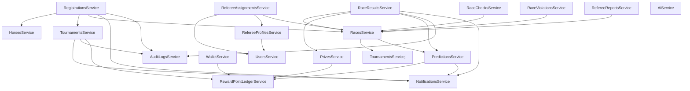

# Bản Đồ Cấu Trúc Hàm Và Sơ Đồ Gọi Hàm Dự Án HorseTrack

Tài liệu này cung cấp cái nhìn toàn diện về cấu trúc các hàm, controller, service và cách thức các thành phần trong dự án **HorseTrack** tương tác và gọi lẫn nhau.

---

## 1. Tổng Quan Kiến Trúc Dự Án
Dự án được xây dựng theo mô hình **Mono-repo**:
*   **Backend (`be/`):** Xây dựng trên nền tảng **NestJS**, kết hợp với **MongoDB (Mongoose)** để quản lý dữ liệu. Toàn bộ logic nghiệp vụ (business logic) tập trung ở các Service class, được tiêm vào (inject) các Controller class để tiếp nhận yêu cầu HTTP.
*   **Frontend (`fe/`):** Xây dựng bằng **Next.js App Router (React + TypeScript)**, hiện tại đang chạy theo mô hình hiển thị dữ liệu giả lập (mock-first) và đang tích hợp dần với hệ thống API Backend.

---

## 2. Sơ Đồ Gọi Hàm và Phụ Thuộc Giữa Các Services (Dependency Map)

Dưới đây là sơ đồ Mermaid mô tả mối quan hệ phụ thuộc (Dependency Injection) giữa các Service chính trong Backend. Một mũi tên từ `Service A` chỉ đến `Service B` nghĩa là `Service A` tiêm `Service B` vào constructor và gọi các hàm của nó:



---

## 3. Bản Đồ Chi Tiết Các Module Backend

Dưới đây là chi tiết các hàm trong từng Service và Controller thuộc thư mục nguồn `be/src`:

| Module/Folder | Class Name & Loại | Dependencies Injected (Tiêm vào Constructor) | Các Hàm Chính & Vai Trò |
| :--- | :--- | :--- | :--- |
| **predictions** | `PredictionsService`<br>*(Service)* | `PredictionModel`, `RaceModel`, `RaceResultModel`, `RegistrationModel`, `RewardPointLedgerService`, `NotificationsService` | **`create()`**: Tạo dự đoán mới, trừ điểm đặt cược.<br>**`findMyPredictions()`**: Lấy lịch sử dự đoán của user hiện tại.<br>**`findAll()`**: Lấy toàn bộ dự đoán hệ thống.<br>**`cancelPredictionsForRace()`**: Hoàn tiền cược và hủy dự đoán khi trận đấu bị hủy.<br>**`payoutBetsForRace()`**: Quyết toán điểm cược (x2 điểm nếu thắng, phạt/trừ điểm nếu thua), gửi thông báo. |
| | `PredictionsController`<br>*(Controller)* | `PredictionsService` | Điều hướng các API quản lý và đặt cược dự đoán. |
| **race-results**| `RaceResultsService`<br>*(Service)* | `RaceResultModel`, `RegistrationModel`, `RefereeAssignmentModel`, `JockeyModel`, `RaceViolationModel`, `RacesService`, `PrizesService`, `PredictionsService`, `AuditLogsService`, `NotificationsService` | **`simulateRaceResults()`**: Trọng tài chạy giả lập kết quả đua ngẫu nhiên (dựa trên chỉ số ngựa, kỹ năng jockey, thời tiết, sự cố), lưu dưới dạng DRAFT.<br>**`create()`**: Ghi nhận thủ công kết quả cho từng con ngựa.<br>**`findByRace()`**: Lấy kết quả đã xuất bản của cuộc đua.<br>**`confirmResultsForRace()`**: Trọng tài xác nhận kết quả (DRAFT -> CONFIRMED).<br>**`publishByRace()`**: Admin xuất bản kết quả (CONFIRMED -> PUBLISHED), kích hoạt phát thưởng (Prizes) và trả thưởng dự đoán (Predictions).<br>**`applyViolationsToResults()`**: Tính toán thời gian phạt hoặc loại ngựa dựa trên biên bản vi phạm để cập nhật lại bảng xếp hạng.<br>**`bulkSave()`**: Trọng tài lưu hàng loạt kết quả nháp. |
| | `RaceResultsController`<br>*(Controller)* | `RaceResultsService` | Các API ghi nhận kết quả, giả lập kết quả, xác nhận và xuất bản kết quả cuộc đua. |
| **races** | `RacesService`<br>*(Service)* | `RaceModel`, `RegistrationModel`, `RaceCheckModel`, `RefereeAssignmentModel`, `TournamentsService`, `PredictionsService` | **`create()`**: Tạo cuộc đua mới trong giải đấu.<br>**`findAll()`**: Lấy toàn bộ danh sách cuộc đua.<br>**`findByTournament()`**: Lấy danh sách các cuộc đua của giải đấu.<br>**`findOne()`**: Xem chi tiết cuộc đua.<br>**`update()`**: Cập nhật thông tin cuộc đua.<br>**`updateStatus()`**: Chuyển trạng thái cuộc đua (SCHEDULED ➔ LIVE ➔ FINISHED ➔ RESULT_PUBLISHED).<br>**`validateReadyConditions()`**: Kiểm tra điều kiện cuộc đua sẵn sàng (đủ ngựa, có trọng tài). |
| | `RacesController`<br>*(Controller)* | `RacesService` | Các API CRUD cuộc đua. |
| **registrations**| `RegistrationsService`<br>*(Service)* | `RegistrationModel`, `HorsesService`, `TournamentsService`, `RacesService`, `NotificationsService`, `AuditLogsService` | **`create()`**: Chủ ngựa đăng ký ngựa vào cuộc đua.<br>**`findAll()`**: Lấy toàn bộ danh sách đăng ký.<br>**`findMyRegistrations()`**: Danh sách đăng ký của chủ ngựa hiện tại.<br>**`approve()`**: Admin duyệt đăng ký thi đấu.<br>**`reject()`**: Admin từ chối đăng ký thi đấu.<br>**`cancel()` / `withdraw()`**: Hủy đăng ký thi đấu. |
| | `RegistrationsController`<br>*(Controller)* | `RegistrationsService` | Các API đăng ký và xét duyệt ngựa thi đấu. |
| **reward-point-ledger**| `RewardPointLedgerService`<br>*(Service)* | `RewardPointLedgerModel` | **`getBalance()`**: Lấy số dư điểm thưởng của ví user.<br>**`credit()`**: Cộng điểm thưởng vào ví (do thắng cược, trúng giải, nạp tiền).<br>**`debit()`**: Trừ điểm ví (do đặt cược, rút tiền).<br>**`findByUser()`**: Xem lịch sử biến động số dư của user. |
| | `RewardPointLedgerController`<br>*(Controller)* | `RewardPointLedgerService` | API truy vấn ví và lịch sử giao dịch điểm. |
| **tournaments** | `TournamentsService`<br>*(Service)* | `TournamentModel`, `RaceModel`, `RegistrationModel`, `PredictionModel`, `NotificationsService`, `AuditLogsService`, `RewardPointLedgerService` | **`create()`**: Tạo giải đấu mới.<br>**`findAll()`**: Liệt kê giải đấu kèm trạng thái.<br>**`findOne()`**: Lấy thông tin giải đấu và các cuộc đua trực thuộc.<br>**`updateStatus()`**: Thay đổi trạng thái giải đấu.<br>**`cascadeCancel()`**: Hủy toàn bộ giải đấu và tự động hủy các trận đấu con, hoàn trả cược cho spectator. |
| | `TournamentsController`<br>*(Controller)* | `TournamentsService` | Các API CRUD giải đấu. |
| **referee-assignments**| `RefereeAssignmentsService`<br>*(Service)* | `RefereeAssignmentModel`, `RaceModel`, `UsersService`, `RefereeProfilesService`, `RacesService` | **`create()`**: Admin phân công trọng tài vào cuộc đua.<br>**`getAvailableReferees()`**: Tìm các trọng tài rảnh trong khung giờ cuộc đua.<br>**`respond()`**: Trọng tài chấp nhận hoặc từ chối phân công.<br>**`findByRace()`**: Xem trọng tài được giao cho cuộc đua.<br>**`findMyAssignments()`**: Xem danh sách trận đấu được phân công của trọng tài. |
| | `RefereeAssignmentsController`<br>*(Controller)* | `RefereeAssignmentsService` | Điều hướng API phân công và phản hồi phân công trọng tài. |
| **jockey-invitations**| `JockeyInvitationsService`<br>*(Service)* | `JockeyInvitationModel`, `RegistrationModel`, `JockeyModel`, `RaceModel`, `UsersService`, `NotificationsService` | **`create()`**: Chủ ngựa mời jockey cưỡi ngựa đã đăng ký.<br>**`respond()`**: Jockey chấp nhận (Liên kết jockey vào Registration) hoặc từ chối mời.<br>**`findMyReceived()` / `findMySent()`**: Xem thư mời đã nhận/đã gửi. |
| | `JockeyInvitationsController`<br>*(Controller)* | `JockeyInvitationsService` | API gửi và quản lý lời mời jockey. |
| **wallet** | `WalletService`<br>*(Service)* | `UserModel`, `WalletTransactionModel`, `CashoutRequestModel`, `RewardPointLedgerService` | **`deposit()`**: Nạp tiền mặt quy đổi thành điểm thưởng.<br>**`requestCashout()`**: Gửi yêu cầu rút tiền đổi từ điểm thưởng.<br>**`processCashout()`**: Admin duyệt hoặc từ chối yêu cầu rút tiền. |
| | `WalletController`<br>*(Controller)* | `WalletService` | API giao dịch tài chính/nạp rút. |
| **users** | `UsersService`<br>*(Service)* | `UsersRepository`, `JockeyModel` | **`create()`**: Đăng ký tài khoản người dùng.<br>**`validateCredentials()`**: Kiểm tra mật khẩu đăng nhập.<br>**`findById()` / `findByEmail()`**: Tìm kiếm user.<br>**`ban()` / `unban()`**: Vô hiệu hóa/Kích hoạt lại tài tài khoản.<br>**`assignRole()`**: Gán phân quyền mới (Admin, Owner, Referee, Spectator, Jockey). |
| | `UsersController`<br>*(Controller)* | `UsersService` | Các API quản lý tài khoản và quyền hạn. |
| **referee-profiles**| `RefereeProfilesService`<br>*(Service)* | `RefereeProfileModel`, `UsersService` | **`createProfile()`**: Tạo thông tin hồ sơ chi tiết cho trọng tài.<br>**`changeApproval()`**: Phê duyệt hồ sơ trọng tài. |
| **jockeys** | `JockeysService`<br>*(Service)* | `JockeyModel`, `RaceResultModel`, `UsersService` | **`createProfile()`**: Tạo hồ sơ nài ngựa (Jockey).<br>**`changeStatus()`**: Thay đổi trạng thái hoạt động của nài ngựa. |
| **prizes** | `PrizesService`<br>*(Service)* | `PrizeModel`, `RaceResultModel`, `RaceModel`, `HorseModel`, `RegistrationModel`, `RefereeAssignmentModel`, `RewardPointLedgerService` | **`createPrizesForRace()`**: Tự động tính toán chia giải thưởng cho Chủ ngựa đạt hạng cao (và trọng tài điều hành trận đấu), tạo lịch sử giao dịch ví. |
| **race-checks** | `RaceChecksService`<br>*(Service)* | `RaceCheckModel`, `RegistrationModel`, `RefereeAssignmentModel`, `RacesService` | **`initializeChecksForRace()`**: Tạo các đầu mục kiểm tra trước trận đấu (khám sức khỏe ngựa, cân nặng nài ngựa).<br>**`updateStatus()`**: Trọng tài cập nhật trạng thái kiểm tra (PASSED / FAILED). |
| **race-violations**| `RaceViolationsService`<br>*(Service)* | `RaceViolationModel`, `RefereeAssignmentModel`, `RacesService` | **`create()`**: Trọng tài lập biên bản ghi nhận hành vi vi phạm của ngựa/jockey. |
| **notifications**| `NotificationsService`<br>*(Service)* | `NotificationModel`, `NotificationsGateway` | **`send()`**: Gửi thông báo đến tài khoản đích (và truyền phát thời gian thực qua WebSockets/Socket.IO). |
| **ai** | `AiService`<br>*(Service)* | `UserModel`, `WalletTransactionModel`, `AIPredictionPackageModel`, `PaymentModel`, `UserSubscriptionModel`, `AIPredictionSuggestionModel`, `AIRaceArrangementSuggestionModel` | **`createPredictionSuggestion()`**: AI phân tích các trận đấu cũ để đưa ra gợi ý chiến mã có xác suất thắng cao nhất cho gói đăng ký VIP.<br>**`createArrangementSuggestion()`**: AI hỗ trợ Admin sắp xếp lịch trình cuộc đua tối ưu tránh trùng lịch trọng tài hoặc quá tải ngựa. |

---

## 4. Các Luồng Nghiệp Vụ Chính & Sự Tương Tác Giữa Các Hàm

Để hiểu rõ cách các hàm gọi nhau khi thực hiện một chức năng nghiệp vụ, hãy tham khảo 3 luồng hoạt động chính dưới đây:

### Luồng 1: Đăng Ký Thi Đấu và Mời Nài Ngựa (Registration & Jockey Invitation)
Khi một chủ ngựa (Horse Owner) muốn đăng ký ngựa của mình thi đấu giải:

```
[Chủ ngựa] ──(HTTP POST)──> RegistrationsController.create()
                                  │
                                  ▼
                            RegistrationsService.create()
                                  │
                       ┌──────────┴──────────┐
                       ▼                     ▼
             HorsesService.findOne()     RacesService.findOne()
                       │
                       ▼ (Đăng ký thành công trạng thái PENDING)
                       │
[Chủ ngựa] ──(HTTP POST)──> JockeyInvitationsController.create()
                                  │
                                  ▼
                            JockeyInvitationsService.create()
                                  │
                                  ▼ (Gửi lời mời và gửi thông báo tới Jockey)
                            NotificationsService.send()
                                  │
                                  ▼ (Socket.IO Realtime)
                            NotificationsGateway.emit()
```
*   **Khi Jockey chấp nhận:** `JockeyInvitationsService.respond(ACCEPTED)` sẽ cập nhật trực tiếp `jockeyUserId` trong bản ghi `Registration` tương ứng sang thông tin Jockey vừa đồng ý.

---

### Luồng 2: Điều Hành Trận Đấu, Ghi Nhận Sự Cố & Kết Quả (Referee Operation & Incident)
Trọng tài (Referee) tiến hành giám sát và chấm điểm trận đấu:

```
[Trọng tài] ──(HTTP POST)──> RaceViolationsController.create() (Ghi nhận vi phạm)
                                  │
                                  ▼
                             RaceViolationsService.create()
                                  │
                                  ▼ (Lưu RaceViolation vào DB)
                                  
[Trọng tài] ──(HTTP POST)──> RaceResultsController.simulateRaceResults() (Giả lập chạy)
                                  │
                                  ▼
                             RaceResultsService.simulateRaceResults()
                                  │
                                  ├─► Lấy danh sách APPROVED Registrations
                                  ├─► Tính toán thời gian chạy thực tế (có cộng trừ bonus)
                                  ├─► Gọi applyViolationsToResults()
                                  │         │
                                  │         ▼ (Quy đổi điểm phạt & cập nhật lại thứ hạng)
                                  │      Đọc dữ liệu vi phạm từ RaceViolation
                                  │      Áp dụng phạt cộng giây (+3s/6s/12s) hoặc truất quyền (DQ)
                                  │      Sắp xếp lại thứ hạng (Rank) của các ngựa về đích hợp lệ
                                  │
                                  ├─► Tạo bản ghi RaceResult (Trạng thái DRAFT)
                                  └─► RacesService.updateStatus(raceId, FINISHED)
```

---

### Luồng 3: Xác Nhận, Xuất Bản Kết Quả & Trả Thưởng (Confirmation, Publish & Payouts)
Khi giải đấu kết thúc và Admin thực hiện công bố bảng xếp hạng cuối cùng:

```
[Admin] ──(HTTP PATCH)──> RaceResultsController.publishByRace()
                                 │
                                 ▼
                           RaceResultsService.publishByRace()
                                 │
         ┌───────────────────────┼───────────────────────┐
         ▼                       ▼                       ▼
   RacesService.            PrizesService.         PredictionsService.
  updateStatus()          createPrizesForRace()    payoutBetsForRace()
(RESULT_PUBLISHED)               │                       │
                                 ▼                       ▼
                        Tính tiền thưởng cho      Quét danh sách Spectator
                        chủ ngựa đạt Rank 1.     đặt cược cho cuộc đua này.
                                 │                       │
                                 ├───────────────────────┤
                                 ▼                       ▼
                      [RewardPointLedger.credit]   [NotificationsService.send]
                       Cộng tiền thưởng vào ví     Gửi thông báo chúc mừng /
                        và tạo Ledger Transaction     báo kết quả dự đoán.
```

---

## 5. Cấu Trúc Định Tuyến Trên Frontend (Next.js Routes)

Các hàm xử lý giao diện phía Frontend được phân bổ dựa trên vai trò người dùng (Role-based Routing) thông qua cấu trúc Route Groups của Next.js:

*   **Public Routes (`fe/app/(public)/`)**:
    *   `/tournaments`: Xem danh sách giải đấu và thông tin chi tiết giải đấu (`/tournaments/[tournamentId]`).
    *   `/races`: Danh sách cuộc đua và chi tiết cuộc đua (`/races/[raceId]`).
*   **Auth Routes (`fe/app/(auth)/`)**:
    *   `/login`: Giao diện đăng nhập.
    *   `/register`: Giao diện đăng ký thành viên.
*   **Dashboard Routes (`fe/app/(dashboard)/`)**:
    *   `/admin`: Bảng điều khiển admin quản lý giải đấu, phê duyệt tài khoản, xuất bản kết quả, phê duyệt nạp rút ví.
    *   `/owner`: Chủ ngựa quản lý danh sách ngựa (`/owner/horses`), đăng ký đua (`/owner/registrations`), mời jockey.
    *   `/jockey`: Nài ngựa quản lý lời mời cưỡi ngựa, xem lịch trình đua được phân công.
    *   `/referee`: Trọng tài xem danh sách phân công nhiệm vụ, thực hiện tích chọn khám sức khỏe ngựa (Checks), nhập biên bản phạt (Violations), và giả lập kết quả đua.
    *   `/spectator`: Người xem theo dõi kết quả, thực hiện đặt cược dự đoán cho các chiến mã, nạp tiền/rút tiền ví.
